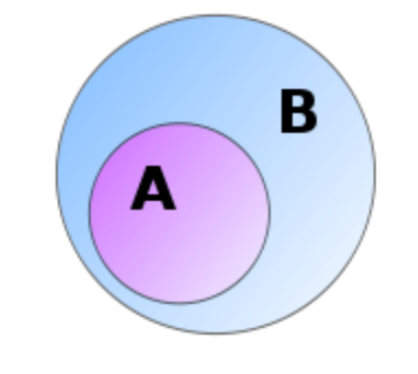

# Lecture 11: Sets

**Sets - why should you care?**

- Sets are an important data structure when programming.
- Sets are very important concepts CS and maths.
- Set notation is used a lot in writing about CS and maths.
- The standard approach to building maths up from logic is based on sets.

Sets are vital in expressing mathematics formally and are also very important
data structures in computer science.

A set is basically just an unordered collection of distinct objects, which we
call its _elements_ or _members_. Note that there is no notion of order for a
set, even though we often write down its elements in some order for convenience.
Also, there is no notion of multiplicity: an object is either in a set or not -
it cannot be in the set multiple times.

Sets _A_ and _B_ are equal when every element of _A_ is an element of _B_ and
vice-versa.

## 11.1 Set notation

- $x \in S$ means that _x_ is an element of set _S_.
- $\{x_1, x_2, x_3, \dots \}$ is the set with elements $x_1, x_2, x_3, \dots$
- $\{x : P(x) \}$ is the set of all _x_ with property _P_.

**Example.**

$$17 \in \{ x : x \text{ is prime } \} = \{2,3,5,7,11,13,\dots\}$$
$$\{1,2,3\} = \{3,1,2\}$$
$$\{1,1,1\} - \{1\}$$

For a finite set $S$, we write $|S|$ for the number of elements of $S$.

**Question:** Let $S = \{a, \{a\}, \{b\}, \{a,b,c\}\}$.

Is $a \in S$? Yes

Is $b \in S$? No

**Question:** Is $\{a\} \in S$? Is $\{a,b\} \in S$?

Answer: Yes, No.

**Question:**

Let $R = \{a,b,c\}$. What is $|R|$? **3**

Let $S = \{a,\{a\},\{b\},\{a,b,c\}\}$. What is $|S|$? **4**

Let $T = \{0,1,2,\dots,100\}$. What is $|T|$? **101**

What is $|\{\}|$? **0**

### Question 11.1

$E(x): $ "x is even"

$F(x): $ "5 divides x" (Assume we're working in the integers $\geq 0$).

What is the set $\{ x: E(x) \land F(x) \}$?

The set containing all multiples of 10, that is $\{0,10,20,30,\dots\}$.

Write a formula for the set $\{5,15,25,35,\dots\}$.

$\{x: \neg E(x) \land F(x)\}$

## 11.2 Universal set

The idea of a "set of all sets" leads to logical difficulties. Difficulties are
avoided by always working within a local "universal set" which includes only
those objects under consideration.

For example, when discussing arithmetic it might be sufficient to work just with
numbers $0,1,2,3,\dots$. Our universal set could then be taken as

$$\mathbb{N} = \{0,1,2,3,\dots \}$$

, and other sets of interest, e.g. $\{x: x \text{ is prime } \}$, are parts of
$\mathbb{N}$.

### Important sets

- $\mathbb{N}$ natural numbers $\{0,1,2,\dots\}$.
- $\mathbb{Z}$ integers $\{\dots, -2, -1,0,1,2,\dots\}$
- $\mathbb{Q}$ rational numbers $\{\frac{a}{b}: a,b \in \mathbb{Z}, b \not =
  0\}$
- $\mathbb{R}$ real numbers
- $\emptyset$ empty set $\{\}$

## 11.3 Subsets

We say that $A$ is a _subset_ of $B$ and write $A \subseteq B$ when each element
of $A$ is an element of $B$.

**Example.** The set of primes forms a _subset_ of $\mathbb{N}$, that is $\{x: x
\text{ is prime }\} \subseteq \mathbb{N}$.

Formally, $A \subseteq B$ if $\forall x(x \in A \rightarrow x \in B)$.

That is, $A$ is a subset of $B$ if every element of $A$ is also an element of
$B$.

**Notes:** Every set is a subset of itself. $\{\}$ is a subset of every set.

**Question:** Let $S = \{a, \{a\}, \{b\}, \{a,b,c\}\}$.

Is $\{b\} \subseteq S$? No, because $b \not \in S$.

Is $\{a, \{a,b,c\},\} \subseteq S$? Yes, because $a \in S$ and $\{a,b,c\} \in
S$.

**Question:** Is $\{a,b\} \subseteq S$? Is $\{\{a\}, \{b\}\} \subseteq S$?

- A: Yes, yes
- B: Yes, no
- C: No, yes
- D: No, no

**Answer:**

$\{a,b\} \not \subseteq S$ because $b \not \in S$.

$\{\{a\},\{b\}\} \subseteq S$ because $\{a\} \in S$ and $\{b\} \in S$.

So C.

## 11.4 Characteristic functions

A subset $A$ of $B$ can be specified by its _characteristic function_ $\chi A$,
which tells which elements of $B$ are in $A$ and which are not.

$$
\chi A(a) =
     \begin{cases}
       1 &\text{ if } x \in A \\
       0 &\text{ if } x \not \in A \\
     \end{cases}
$$

**Example.** The subset $A = \{a,c\}$ of $B = \{a,b,c\}$ has the characteristic
function $\chi_A$ with

$$\chi_A(a) = 1, \chi_A(b) = 0, \chi_A(c) = 1$$

We also write this function more simply as

- a b c
- 1 0 1

In fact we can list all characteristic functions on $\{a,b,c\}$, and hence all
subsets of $\{a,b,c\}$, by listing all sequences of three binary digits:

| characteristic function | subset |
|-------------------------|--------|
| a b c                   |        |
| 0 0 0                   | $\{\}$ |
| 0 0 1                   | $\{c\}$ |
| 0 1 0                   | $\{b\}$ |
| 0 1 1                   | $\{b,c\}$ |
| 1 0 0                   | $\{a\}$ |
| 1 0 1                   | $\{a,c\}$ |
| 1 1 0                   | $\{a,b\}$ |
| 1 1 1                   | $\{a,b,c\}$ |

We could similarly list all the subsets of a four-element set, and there would
be $2^4 = 16$ of them, corresponding to the $2^4$ sequences of 0s and 1s.

In the same way, we find that an n-element set has $2^n$ subsets, because there
are $2^n$ binary sequences of length $n$. (Each of the $n$ places in the
sequences can be filled in two ways.)

## 11.5 Power set

The set of all subsets of a set $U$ is called the _power set_ $\wp(U)$ of
$U$.

**Example.** We see from the previous table that $\wp(a\{a,b,c\})$ is the
set

$$\{\{\},\{c\},\{b\},\{b,c\},\{a\},\{a,c\},\{a,b\},\{a,b,c\}\}.$$

If $U$ has $n$ elements, then $\wp(U)$ has $2^n$ elements.
