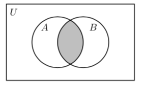
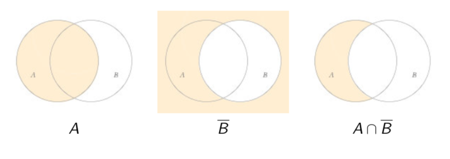

# Lecture 12: Operations on Sets

There is an "arithmetic" of sets similar to ordinary arithmetic. There are
operations similar to addition, subtraction and multiplication.

## 12.1 Venn diagrams

The simple operations on sets can be visualised with the help of _Venn
diagrams_, which show sets  as disks within a rectangle
representing the universal set .

## 12.2 Union

The union  of sets  and  consists of the elements in  _or_
, and is indicated by the shaded region in the following Venn diagram.

## 12.3 Intersection

The intersection  of sets  and  consists of the elements in 
_and_ , indicated by the shaded region in the following Venn diagram.

**Questions**

What is ? = 

What is ? = 

What is ? = 

What is ? = 

What is ? = 

## 12.4 Difference

The difference  of sets  and  consists of the elements in  and
_not_ in , indicated by the shaded region in the following Venn diagram.

The difference  relative to the universal set  is called the
_complement_  of . Here is the Venn diagram of .

## 12.5 Symmetric difference

The union of  and  is called the _symmetric difference_  of  and .

 consists of the elements of _one_ of  but not the other.

It is clear from the diagram that we have not only

but also

**Questions**

What is ? = 

What is ? = 

What is ? = 

What is ? = 

What is ? = 

**Question** Let . If we know that , what can we say about ?

- **A.**  must equal 
- **B.**  must equal 
- **C.**  can be any set such that 
- **D.**  can be any set such that 

**Answer**

Note . So for  to be a subset of  we need
that each of 0,1,2 is an element of . This is definitely true
for 0 and 1 because they're in . So we just need that 2 be an
element of . So **D**.

**Question 12.1** Draw a Venn diagram for . What is another
name for this set?

So .

**Question 12.2** Show that  is true using Venn diagrams.

So 
