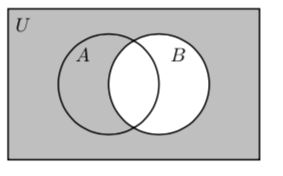

# Lecture 12: Operations on Sets

There is an "arithmetic" of sets similar to ordinary arithmetic. There are
operations similar to addition, subtraction and multiplication.

## 12.1 Venn diagrams

The simple operations on sets can be visualised with the help of _Venn
diagrams_, which show sets  as disks within a rectangle
representing the universal set .

## 12.2 Union

The union  of sets  and  consists of the elements in  _or_
, and is indicated by the shaded region in the following Venn diagram.

## 12.3 Intersection

The intersection  of sets  and  consists of the elements in 
_and_ , indicated by the shaded region in the following Venn diagram.

**Questions**

What is ? = 

What is ? = 

What is ? = 

What is ? = 

What is ? = 

## 12.4 Difference

The difference  of sets  and  consists of the elements in  and
_not_ in , indicated by the shaded region in the following Venn diagram.

The difference  relative to the universal set  is called the
_complement_  of . Here is the Venn diagram of .

