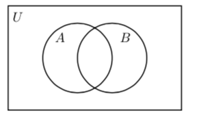
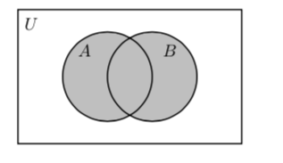
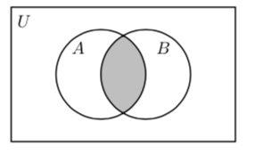
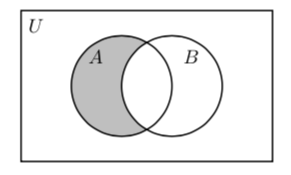
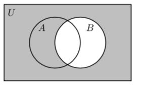
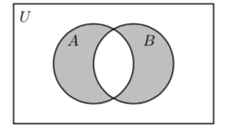
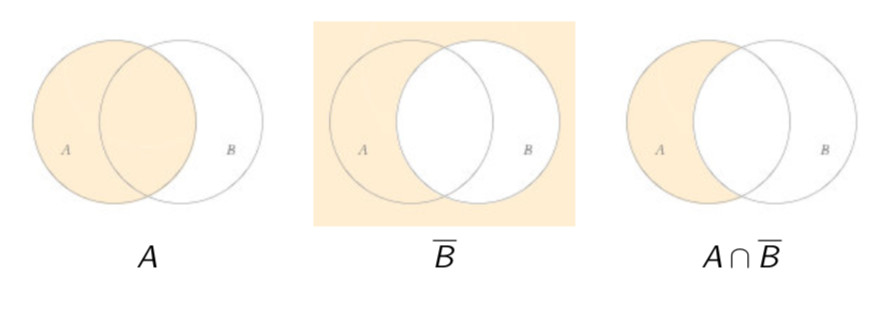

# Lecture 12: Operations on Sets

There is an "arithmetic" of sets similar to ordinary arithmetic. There are
operations similar to addition, subtraction and multiplication.

## 12.1 Venn diagrams

The simple operations on sets can be visualised with the help of _Venn
diagrams_, which show sets $A,B,C,\dots$ as disks within a rectangle
representing the universal set $U$.

## 12.2 Union

The union $A \cup B$ of sets $A$ and $B$ consists of the elements in $A$ _or_
$B$, and is indicated by the shaded region in the following Venn diagram.

## 12.3 Intersection

The intersection $A \cap B$ of sets $A$ and $B$ consists of the elements in $A$
_and_ $B$, indicated by the shaded region in the following Venn diagram.

**Questions**

What is $\{1,2,3\} \cup \{2,5,7\}$? = $\{1,2,3,5,7\}$

What is $\{1,2,3\} \cap \{2,3,6,7\}$? = $\{2,3\}$

What is $\{1,2,3\} \cup \{2,3\}$? = $\{1,2,3\}$

What is $\{1,2,3\} \cap \{3\}$? = $\{3\}$

What is $\{1,2,3\} \cap \{7,8\}$? = $\{\}$

## 12.4 Difference

The difference $A - B$ of sets $A$ and $B$ consists of the elements in $A$ and
_not_ in $B$, indicated by the shaded region in the following Venn diagram.

The difference $U - B$ relative to the universal set $U$ is called the
_complement_ $\overline{B}$ of $B$. Here is the Venn diagram of $\overline{B}$.

## 12.5 Symmetric difference

The union of $A-B$ and $B-A$ is called the _symmetric difference_ $A \triangle
B$ of $A$ and $B$.

$A \triangle B$ consists of the elements of _one_ of $A,B$ but not the other.

It is clear from the diagram that we have not only

$$A \triangle B = (A-B) \cup (B-A)$$

but also

$$A \triangle B = (A \cup B) - (A \cap B)$$

**Questions**

What is $\{1,2,3\} = \{2,5,7\}$? = $\{1,3\}$

What is $\{1,2,3\} = \triangle \{2,3,6,7\}$? = $\{1,6,7\}$

What is $\{2,3\} - \{1,2,3\}$? = $\{\}$

What is $\{1,2,3\} \triangle \{3\}$? = $\{1,2\}$

What is $\{1,2,3\} - \{7,8\}$? = $\{1,2,3\}$

**Question** Let $S = \{-2,-1,0,1,2\} \cap \mathbb{N}$. If we know that $S
\subseteq (\{-1,0,1\} \cup T)$, what can we say about $T$?

- **A.** $T$ must equal $\{2\}$
- **B.** $T$ must equal $\mathbb{N}$
- **C.** $T$ can be any set such that $-2 \in T$
- **D.** $T$ can be any set such that $2 \in T$

**Answer**

Note $S = \{0,1,2\}$. So for $S$ to be a subset of $\{-1,0,1\} \cup T$ we need
that each of 0,1,2 is an element of $\{-1,0,1\} \cup T$. This is definitely true
for 0 and 1 because they're in $\{-1,0,1\}$. So we just need that 2 be an
element of $T$. So **D**.

**Question 12.1** Draw a Venn diagram for $A \cap \overline{B}$. What is another
name for this set?

So $A \cap \overline{B} = A - B$.

**Question 12.2** Show that $\overline{A \cup B} = \overline{A} \cap
\overline{B}$ is true using Venn diagrams.

So $\overline{A \cup B} = \overline{A} \cap \overline{B}$
