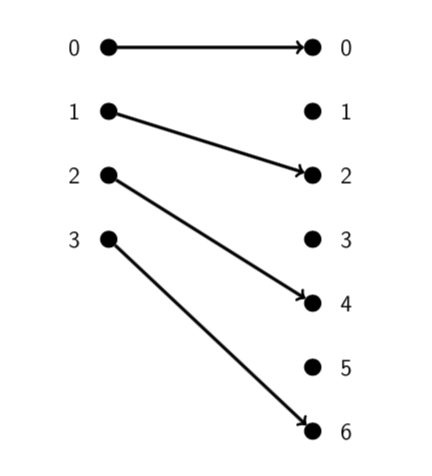

# Lecture 13: Functions

**Functions - why should you care?**

The concept of a function is extremely important in both computer science and
maths.

- Functions (subroutines) in programming are closely related to functions in the
  mathematical sense.
- In the case of functional programming languages (e.g. Lisp, Haskell, Rust)
  they are exactly functions in the mathematical sense.
- Functions are used to define a lot of important concepts in maths and
  theoretical computer science.

A function can be thought of as a "black box" which accepts inputs and, for each
input, produces a single output.

- Each input produces exactly one output. (Always the same output for a given
  input).
- Input = Domain
- Output = Codomain

**Remember:** The domain and codomain are part of the function and must always
be defined.

## 13.1 Defining functions via sets

Formally we represent a function  as a set  of possible inputs, a set 
so that every output of  is guaranteed to be in , and a set of (input,
output) pairs from . The vital property of a function is that each
input gives exactly one output.

A function  consists of a _domain_ , a _codomain_ , and a set of
ordered pairs from  which has exactly one ordered pair  for
each .

When  is in this set we write .

The set of  values occurring in these pairs in the _image_ of .

Note that the image of a function is always a subset of its codomain but they
may or may not be equal.

If the image of a function is equal to its codomain, we say that the function is
_onto_.

Formally, a function consists of a domain , a codomain , and a set of
ordered pairs from  which has exactly one ordered pair  for
each .

The set of  values occurring in these ordered pairs is called the _image_ of
the function.

The image is always a subset of the codomain but they may not be equal. If they
are equal we say the function is _onto_.

" is a function with domain  and codomain " is shortened to .

**Example** Let  be defined by
.

|  |  |
|-----|--------|
|  0  |    0   |
|  1  |    2   |
|  2  |    4   |
|  3  |    6   |

**Example** Let  be defined by .

## Arrow Diagrams

**Example** Let  be defined by
.

The image of  is . (So  is not onto.)

**Question**

Why don't we always set the codomain equal to the image?

Think about  defined by .

We've set the codomain to  and that's fine - certainly .

What is the image of ? Hard to find and probably ugly.

Another reason is that " functions", for
example, make a nice class to consider.

**Question** What set of ordered pairs does  defined by  correspond to?
