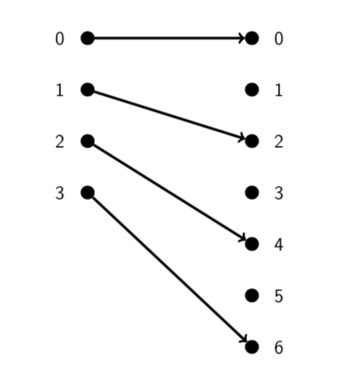
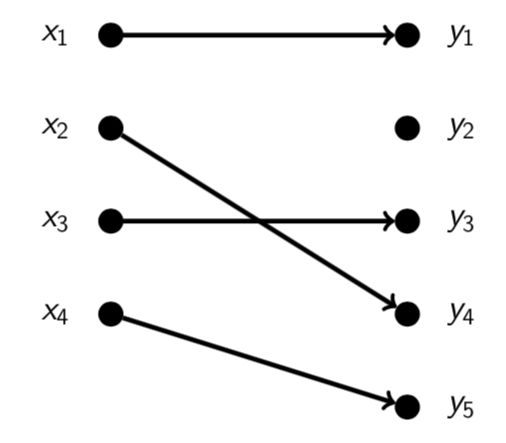

# Lecture 13: Functions

**Functions - why should you care?**

The concept of a function is extremely important in both computer science and
maths.

- Functions (subroutines) in programming are closely related to functions in the
  mathematical sense.
- In the case of functional programming languages (e.g. Lisp, Haskell, Rust)
  they are exactly functions in the mathematical sense.
- Functions are used to define a lot of important concepts in maths and
  theoretical computer science.

A function can be thought of as a "black box" which accepts inputs and, for each
input, produces a single output.

- Each input produces exactly one output. (Always the same output for a given
  input).
- Input = Domain
- Output = Codomain

**Remember:** The domain and codomain are part of the function and must always
be defined.

## 13.1 Defining functions via sets

Formally we represent a function $f$ as a set $X$ of possible inputs, a set $Y$
so that every output of $f$ is guaranteed to be in $Y$, and a set of (input,
output) pairs from $X \times Y$. The vital property of a function is that each
input gives exactly one output.

A function $f$ consists of a _domain_ $X$, a _codomain_ $Y$, and a set of
ordered pairs from $X \times Y$ which has exactly one ordered pair $(x,y)$ for
each $x \in X$.

When $(a,b)$ is in this set we write $f(a) = b$.

The set of $y$ values occurring in these pairs in the _image_ of $f$.

Note that the image of a function is always a subset of its codomain but they
may or may not be equal.

If the image of a function is equal to its codomain, we say that the function is
_onto_.

Formally, a function consists of a domain $X$, a codomain $Y$, and a set of
ordered pairs from $X \times Y$ which has exactly one ordered pair $(x,y)$ for
each $x \in X$.

The set of $y$ values occurring in these ordered pairs is called the _image_ of
the function.

The image is always a subset of the codomain but they may not be equal. If they
are equal we say the function is _onto_.

"$f$ is a function with domain $X$ and codomain $Y$" is shortened to $f: X
\rightarrow Y$.

**Example** Let $f: \{0,1,2,3\} \rightarrow \{0,1,2,3,4,5,6\}$ be defined by
$f(x) = 2x$.

| $x$ | $f(x)$ |
|-----|--------|
|  0  |    0   |
|  1  |    2   |
|  2  |    4   |
|  3  |    6   |

$$\{(0,0),(1,2),(2,4),(3,6)\}$$

**Example** Let $f: \mathbb{R} \rightarrow \mathbb{R}$ be defined by $f(x) =
2x$.

$$\{(x,2x): x \in \mathbb{R}\}$$

## Arrow Diagrams

**Example** Let $f: \{0,1,2,3\} \rightarrow \{0,1,2,3,4,5,6\}$ be defined by
$f(x) = 2x$.

The image of $f$ is $\{0,2,4,6\}$. (So $f$ is not onto.)

**Question**

Why don't we always set the codomain equal to the image?

Think about $f: \mathbb{R} \rightarrow \mathbb{R}$ defined by $f(x) = x^8 +
102x^7 - 7x^5 + 20x^4 - 100x + 7$.

We've set the codomain to $\mathbb{R}$ and that's fine - certainly $f(x) \in
\mathbb{R}$.

What is the image of $f$? Hard to find and probably ugly.

Another reason is that "$\mathbb{R} \rightarrow \mathbb{R}$ functions", for
example, make a nice class to consider.

**Question** What set of ordered pairs does $f: \{0,1,2,3\} \rightarrow
\mathbb{N}$ defined by $f(x) = x^2$ correspond to?

$$\{(0,0),(1,1),(2,4),(3,9)\}$$

**Question** Which of the following sets of ordered pairs correspond to
functions from $\{0,1,2\}$ to $\mathbb{R}$?

$$S = \{(0,7),(2,\pi)\}$$
$$T = \{(0,7),(1,1),(2,\pi)\}$$
$$U = \{(0,7),(1,4),(2,\pi),(2,3)\}$$

- **A.** Just T
- **B.** S and T
- **C.** T and U
- **D.** All of them

**Answer** Not **S** - it doesn't have an ordered pair with coordinate 1. Not
**U** - it has two ordered pairs with first coordinate 2. But **T** is fine. So
**A**.

## Square: $\mathbb{R} \rightarrow \mathbb{R}$

**Examples.**

The squaring functions square $(x) = x^2$ with domain $\mathbb{R}$, codomain
$\mathbb{R}$, and pairs

$$\{(x,x^2) : x \in \mathbb{R}\}$$

which form what we usually call the _plot_ of the squaring function.

The image of this function (the set of _y_ values) is the set
$\mathbb{R}^{\geq 0}$ of real numbers $\geq 0$.

## sqrt: $\mathbb{R}^{\geq 0} \rightarrow \mathbb{R}$

The square root function sqrt $(x) = \sqrt{x}$ with domain $\mathbb{R}^{\geq
0}$, codomain $\mathbb{R}$, and pairs

$$\{(x,\sqrt{x}) : x \in \mathbb{R} \text{ and } x \geq 0 \}$$

The image of this function (the set of $y$ values) is the set $\mathbb{R}^{\geq
0}$.

## cube: $\mathbb{R} \rightarrow \mathbb{R}$

The cubing function cube $(x) = x^3$ with domain $\mathbb{R}$, codomain
$\mathbb{R}$, and pairs

$$\{(x,x^3): x \in \mathbb{R}\}$$

The image of this function is the whole of the codomain $\mathbb{R}$, so it is
onto.

## Question 13.1

Which of the following rules define functions?

- For each non-empty set $S$ of natural numbers, let $f(S)$ be the least member
  of $S$.
  - Yes
- For each set $X$ of real numbers between 0 and 1, let $g(X)$ be the least
  member of $X$.
  - No - $g(\{x: x \in \mathbb{R} \text{ and } \frac{1}{2} < x < 1 \})$ is not
    defined.
- For each circle $C$ in the $(x,y)$ plane, let $h(C)$ be the minimum distance
  from $C$ to the x axis.
  - Yes
- For a pair $A, B$ of sets of real numbers let $s(A,B)$ be the smallest set
  which has both $A$ and $B$ as subsets.
  - Yes (depending on your interpretation of "smallest").
  - $s(A,B) = A \cup B$.
- For a pair $A,B$ of sets of real numbers let $t(A,B)$ be the largest set which
  is a subset of both $A$ and $B$.
  - Yes (depending on your interpretation of "largest").
  - $t(A,B) = A \cap B$.

## 13.2 Arrow notation

If $f$ is a function with domain $A$ and codomain $B$ we write:

$$f: A \rightarrow B$$

and we say that $f$ is from $A$ to $B$.

**Question 13.2** Which of the following functions can be defined on the whole
of $\mathbb{R}$, so that the function values also lie in $\mathbb{R}$? (In other
words, which can be $\mathbb{R} \rightarrow \mathbb{R}$ functions?)

- $x^2$ - Yes
- $\frac{1}{x}$ - No undefined for $x = 0$
- $\log(x)$ - No - undefined for $x \leq 0$ (because $e^x > 0$ for all $x \in
  \mathbb{R}$.
- $\sqrt{x}$ - No - undefined for $x < 0$
- $\sqrt[3]{x}$ - Yes

## 13.3 One-to-one functions

A function $f: X \rightarrow Y$ is _one-to-one_ if for each $y$ in the range of
$f$ there is only one $x \in X$ such that $f(x) = y$.

For example, the function cube(x) is one-to-one because each real number $y$ is
the cube of exactly one real number $x$.

The function square: $\mathbb{R} \rightarrow \mathbb{R}$ is _not_ one-to-one
because the real number 1 is the square of two different real numbers, 1 and -1.
(In fact each real $y > 0$ is the square of two different real numbers,
$\sqrt{y}$ and $-\sqrt{y}$)

On the other hand, square: $\mathbb{R}^{\geq 0} \rightarrow \mathbb{R}$ _is_
one-to-one because each real number $y$ in $\mathbb{R}^{\geq 0}$ is the square
of only one real number in $\mathbb{R}^{\geq 0}$, namely $\sqrt{y}$.

The last example shows that the domain of a function is an important part of its
description, because changing the domain can change the properties of the
function.

**Question** Is the function pictured below one-to-one?

Yes

**Question** Is the function pictured below one-to-one?

No. $f(x_2) = f(x_3)$.

## 13.4 Proving a function is one-to-one

There is an equivalent way of phrasing the definition of one-to-one: a function
$f: X \rightarrow Y$ is one-to-one when, for all $x_1, x_2 \in X$,

$$f(x_1) = f(x_2) \Rightarrow x_1 = x_2$$

This can be useful for proving that some functions are or are not one-to-one.

**Example.** The function $f: \mathbb{R} \rightarrow \mathbb{R}$ given by $f(x)
= 6x + 2$ is one-to-one because:

$$f(x_1) = f(x_2)$$
$$\Rightarrow 6x_1 + 2 = 6x_2 + 2$$
$$\Rightarrow 6x_1 = 6x_2$$
$$\Rightarrow x_1 = x_2$$

**Example.** The function $f: \mathbb{R} \rightarrow \mathbb{R}$ given by $f(x)
= x^2 + 1$ is not one-to-one because $f(-1) = 2$ and $f(1) = 2$ and so

$$f(-1) = f(1)$$
