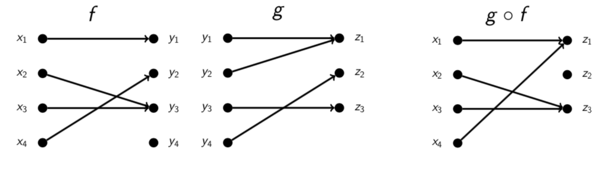
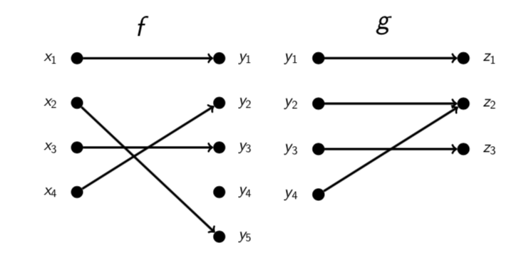

# Lecture 15: Composition and Inversion

Complicated functions are often built from single parts. For example, the
function $f: \mathbb{R} \rightarrow \mathbb{R}$ defined by $f(x) = (x^2 + 1)^3$
is computed by doing the following steps in succession:

* square
* add 1,
* cube.

We say that function $f(x) = (x^2 + 1)^3$ is the composite of the functions
(from $\mathbb{R}$ to $\mathbb{R}$)

- square $(x) = x^2$,
- successor $(x) = x + 1$,
- cube $(x) = x^3$.

## 15.1 Notation for composite functions

In the present example we write $f(x) = $ cube(successor(square(x))), of $f = $
cube $\circ$ successor $\circ$ square.

In general, if $f() = g(h(x))$ we write $f = g \circ h$ and say $f$ is the
_composite_ of $g$ and $h$.

**Warning:** Remember that $g \circ h$ means "do $h$ first, then $g$." $g \circ
h$ is usually different from $h \circ g$.

**Example.**

square(successor(x)) = $(x+1)^2 = x^2 + 2x + 1$

successor(square(x)) = $x^2 + 1$

**Question 15.1** Let _f_, _m_ and _s_ be the functions on the set of people
defined by

- _m(x)_ = mother of _x_
- _f(x)_ = father of _x_
- _s(x)_ = spouse of _x_

What are the following?

- $m \circ s(x)$ mother in law of _x_
- $f \circ s(x)$ father in law of _x_
- $m \circ m(x)$ grandmother (maternal) of _x_
- $f \circ m(x)$ grandfather (maternal) of _x_
- $s \circ s(x)$ _x_

**Question 15.2** Write the following as composites of square(x), sqrt(x),
successor(x) and cube(x).

(Assume that all of these have domain and codomain $\{x: x \in \mathbb{R}$ and
$x \geq 0 \}$.)

- $\sqrt{1 + x^3}$ = sqrt(successor(cube(x))) = sqrt $\circ$ successor $\circ$
  cube(x)
- $x^{\frac{3}{2}}$ = sqrt((cube(x)) = sqrt $\circ$ cube(x)
- $(1+x)^3$ = cube(successor(x)) = cube $\circ$ successor(x)
- $(1+x^3)^2$ = square(successor(cube(x))) = square $\circ$ successor $\circ$
  cube(x)

**Note** Composition of functions is associative: $(f \circ g) \circ h = f \circ
(g \circ h)$. So we don't bother with the brackets.

## 15.2 Conditions for composition

Composite functions do not always exist.

**Example.** If reciprocal $\mathbb{R} - \{0\} \rightarrow \mathbb{R}$ is
defined by reciprocal(x) = $\frac{1}{x}$ and predecessor $: \mathbb{R}
\rightarrow \mathbb{R}$ is defined by predecessor(x) = $x-1$, then reciprocal
$\circ$ predecessor does not exists, because predecessor(1) = 0 is not a legal
input for reciprocal.

To avoid this problem, we demand that the codomain of $h$ be equal to the domain
of $g$ for $g \circ h$ to exist. This ensures that each output of $h$ will be a
legal input of $g$.

Let $g : C \rightarrow D$ and $h: A \rightarrow B$ be functions. The function $g
\circ h$ exists if and only if $C=B$. If it exists, $g \circ h : A \rightarrow
D$ and is defined by $g \circ h(x) = g(h(x))$.

**Question** Let $f: A \rightarrow B$ and $g: C \rightarrow D$ be the functions
pictured below.

Does $g \circ f$ exist?

codomain$(f) = \{y_1, y_2, y_3,y_4\}$ and domain$(g) = \{y_1, y_2, y_3, y_4\}$.
So $g \circ f$ does exist because codomain(f) = domain(g). $g \circ f: A
\rightarrow D$.

**Question** Let $f: A \rightarrow B$ and $g: C \rightarrow D$ be the functions
pictured below.

Does $g \circ f$ exist?

codomain$(f) = \{y_1, y_2, y_3,y_4, y_5\}$ and domain$(g) = \{y_1, y_2, y_3,
y_4\}$. So $g \circ f$ does not exist because codomain(f) $\not =$ domain(g).

**Question** Let _f_, _g_ and _h_ be the functions

- $f: \mathbb{R} \rightarrow \mathbb{Z}$ defined by $f(x) = \lceil x \rceil$.
- $g: \mathbb{Z} \rightarrow \mathbb{R}$ defined by $g(x) = \frac{x}{2}$
- $h: \mathbb{R} \rightarrow \mathbb{R}$ defined by $h(x) = x^2 + 7$

Which of the following statements if **false**?

- **A.** $g \circ f$ exists, $g \circ f: \mathbb{R} \rightarrow \mathbb{R}$
- **B.** $f \circ g$ exists, $f \circ g: \mathbb{Z} \rightarrow \mathbb{Z}$
- **C.** $g \circ h$ does not exist
- **D.** $g \circ f \circ g$ does not exist.

**Answer**

- **A** is true because codomain(f) = domain(g), domain(f) = $\mathbb{R}$,
  codomain(g) = $\mathbb{R}$
- **B** is true because codomain(g) = domain(f), domain(g) = $\mathbb{Z}$,
  codomain(f) = $\mathbb{Z}$
- **C** is true because codomain(h) $\not = $ domain(g)
- **D** is false because codomain(g) = domain$(f \circ g)$.

## 15.3 The identify functions

On each set $A$ the function $i_A : A \rightarrow A$ defined by $$i_A(x) = x$$
is called the _identity function_ (on $A$).
