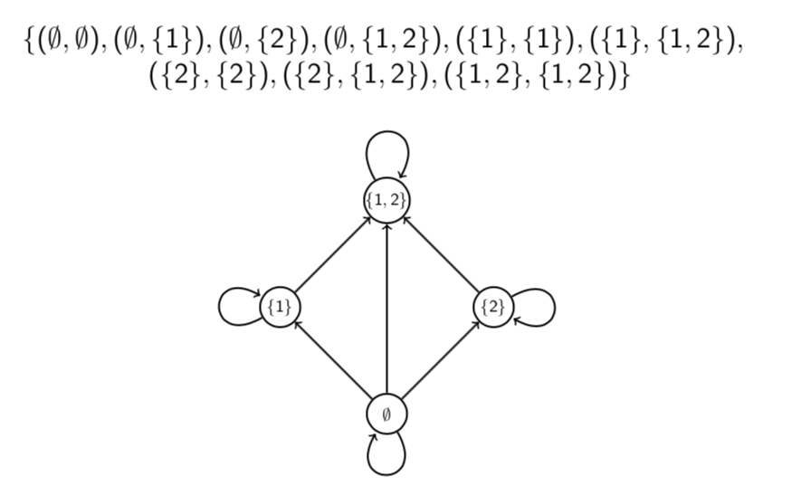
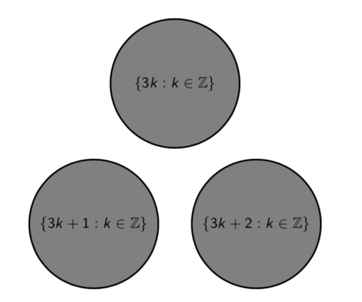

# Lecture 16: Relations

**Relations - why should you care?**

- Relations are used heavily in database theory in computer science.
- They are also used in theories of object orientation in programming.
- Relations can be thought of as a generalisation of functions.
- Like there is a functional programming paradigm there's a relational
  programming paradigm.

Roughly speaking, a binary relation on a set is something that tells us, for
any two things in the set, that they are related or they are not related. (Order
_is_ important.)

We could make a set .

Mathematical objects can be related in various ways, and any particular way of
relating objects is called a _relation_ on the set of objects in question.

(This also applies to relations in the everyday sense. For example, "parent of"
is a relation on the set of people.)

A _binary relation_  on a set  consists of  and a set of ordered pairs
from . When  is in this set we write .

Similarly, a _ternary_ relation on  would be defined by a set of ordered
triples from , and so on. (A _unary_ relation on  is
just a subset of .)

A binary relation  on a set  consists of the set  together with a set
of ordered pairs from .

If  is in the set then we write  and say "x is R-related to y".

If  is not in the set then we write .

Order matters. It might be that  but .

**Arrow diagrams**

**Example** Let  be the relation on  given by the set
.

- Is ? **Yes**
- Is ? **No**
- Is ? **No**
- Is ? **Yes**
- Is ? **Yes**

## 16.1 Relations and functions

Any function  can be viewed as a relation  on . The relation is defined by  if and only if .

However, not every relation is a function. Remember that a function must have
exactly one output  for each input  in its domain. In a relation, on the
other hand, and element  may be related to many elements , or to none at
all.

## 16.2 Examples

**Question** Give the set of ordered pairs for the relation "=" on
 and draw an arrow diagram of it.

**Question** Give the set of orders pairs for the relation  on
 and draw an arrow diagram of it.

**Question** Which of the following binary relations  satisfy ?

1.  defined on  by  if and only if 
2.  defined on  by  if and only if 
3.  defined on  by  if and only if 
4.  defined on  by  if and only if  divides 

- **A** (1), (2) and (3) but not (4)
- **B** (2), (3) and (4) but not (1)
- **C** (2) and (3) but not (1) and (4)
- **D** None of them

**Hint**  means roughly "everything is R-related to
something".

**Answer**

- To show  is true we must find, for each x, a y such
  that .
- To show  is false we must find one specific x such
  that  for all .
- False for (1). If  then  for all .
- True for (2). For each  for example.
- True for (3). For each  for example.
- True for (4). For each  for example.
- So **B**.

**Question 16.2** Use logic symbols and the  relation to write a relation
between real numbers  and  which says that the point  lies in the
square with the corners  and .

**Answer**

### 3. Algebraic curves

An algebraic curve consists of the points  satisfying an equation  where  is a polynomial.

E.g. unit circle . Notice that this relation is not a
function, because there are two pairs with the same , e.g.  and
.

Likewise, the curve  is not a function.

### 4. The subset relation .

This consists of the ordered pairs of sets  such that .
 and  must be subsets of some universal set .

**Question** Give the set of ordered pairs for the relation  on
 and draw an arrow diagram for it.

Remember .

**Question** How many possible relations are there on a set  with ?

- **A** 
- **B** 
- **C** 
- **D** 

**Hint** Think of the relation as a set of ordered pairs. How many possible
ordered pairs are there? So how many possible relations?

**Answer**

- A relation on  can be thought of as a subset of .
- Every subset of  corresponds to a unique relation (and vice
  versa).
- So the number of possible relations on  is the same as the number of
  subsets of .
- . So the number of subsets of  is .
- So **B**.

### 5. Congruence modulo n

For a fixed , congruence modulo  is a binary relation. It consists of the
ordered pairs of integers  such that  divides .

**Congruence modulo _n_**

Remember  (mod n) means that _a_ and _b_ have the same remainder
when you divide them by _n_.

**Definition** We say  (mod n) if _n_ divides .

For a fixed integer , congruence modulo _n_ is a binary relation.

**Question** Which integers are congruent to 1 modulo 7?

Integers in the set . This is
the set .

**Question** Which integers are congruent to 2 modulo 5?

Integers in the set .

This is the set .

## 16.3 Properties of congruence

As the symbol  suggests, congruence mod  is a lot like equality.
Numbers  and  which are congruent mod  are not necessarily equal, but
they are "equal up to multiples of ," because they have equal remainders when
divided by .

Because congruence is like equality, congruence  (mod _n_) behave a
lot like equations. In particular, they have the following three properties.

1. Reflexive property:  (mod ) for any number .
2. Symmetric property:  for any numbers _a_ and _b_.
3. Transitive property:  for any numbers _a,b_ and
   _c_.

These properties are clear if one remembers that  (mod n) means that
a and b have the same remainder on division by n.

**Question** Let _R_ be the binary relation on  defined by  if
and if  (mod 3). Roughly, what would an arrow diagram for _R_ look
like?

