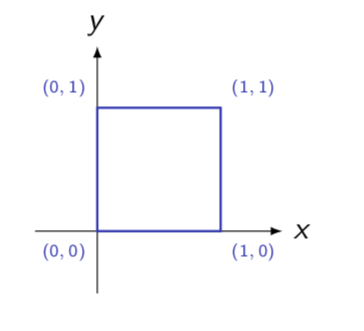
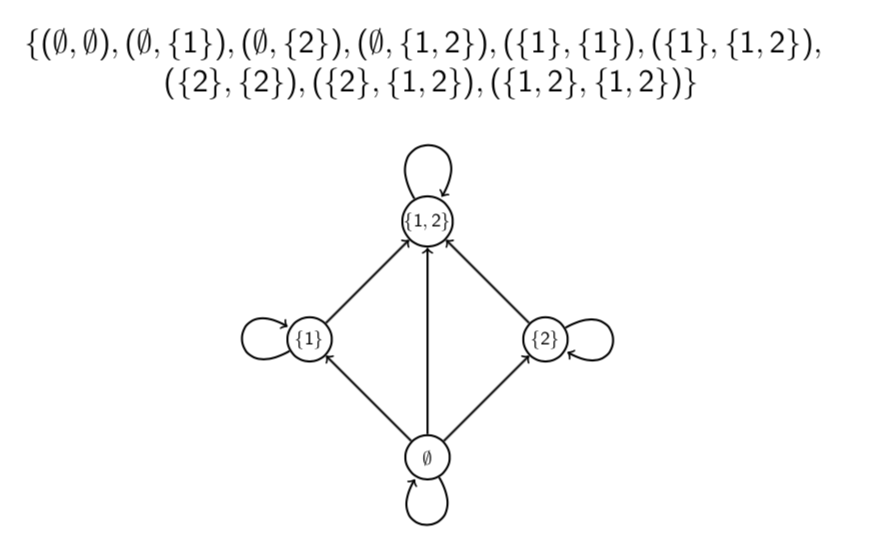
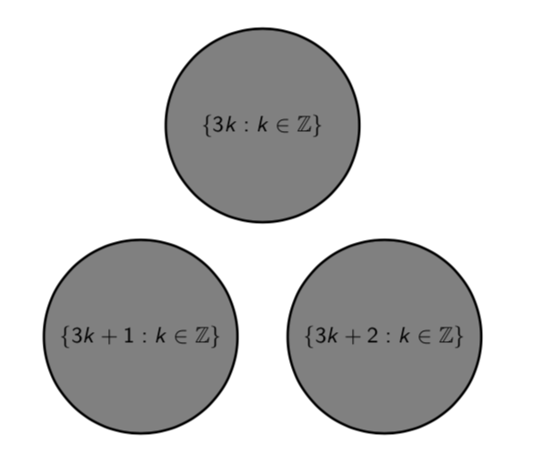

# Lecture 16: Relations

**Relations - why should you care?**

- Relations are used heavily in database theory in computer science.
- They are also used in theories of object orientation in programming.
- Relations can be thought of as a generalisation of functions.
- Like there is a functional programming paradigm there's a relational
  programming paradigm.

Roughly speaking, a binary relation on a set is something that tells us, for
any two things in the set, that they are related or they are not related. (Order
_is_ important.)

We could make a set $\{(x,y): x \text{ links to } y \}$.

Mathematical objects can be related in various ways, and any particular way of
relating objects is called a _relation_ on the set of objects in question.

(This also applies to relations in the everyday sense. For example, "parent of"
is a relation on the set of people.)

A _binary relation_ $R$ on a set $A$ consists of $A$ and a set of ordered pairs
from $A \times A$. When $(a,b)$ is in this set we write $aRb$.

Similarly, a _ternary_ relation on $A$ would be defined by a set of ordered
triples from $A \times A \times A$, and so on. (A _unary_ relation on $A$ is
just a subset of $A$.)

A binary relation $R$ on a set $A$ consists of the set $A$ together with a set
of ordered pairs from $A \times A$.

If $(x,y)$ is in the set then we write $xRy$ and say "x is R-related to y".

If $(x,y)$ is not in the set then we write $x \not R y$.

Order matters. It might be that $xRy$ but $y \not R x$.

**Arrow diagrams**

**Example** Let $R$ be the relation on $\{a,b,c,d,e,f,g,h,i\}$ given by the set
$\{(a,a),(a,b),(b,c),(d,e),(e,d),(i,i)\}$.

- Is $bRc$? **Yes**
- Is $eRf$? **No**
- Is $aRc$? **No**
- Is $dRe$? **Yes**
- Is $iRi$? **Yes**

## 16.1 Relations and functions

Any function $f: X \rightarrow Y$ can be viewed as a relation $R$ on $X \cup
Y$. The relation is defined by $xRy$ if and only if $y=f(x)$.

However, not every relation is a function. Remember that a function must have
exactly one output $y$ for each input $x$ in its domain. In a relation, on the
other hand, and element $x$ may be related to many elements $y$, or to none at
all.

## 16.2 Examples

**Question** Give the set of ordered pairs for the relation "=" on
$\{1,2,3,4,5,6\}$ and draw an arrow diagram of it.

**Question** Give the set of orders pairs for the relation $"<"$ on
$\{1,2,3,4,5,6\}$ and draw an arrow diagram of it.

**Question** Which of the following binary relations $R$ satisfy $\forall X
\exists y (xRy)$?

1. $R$ defined on $\mathbb{R}$ by $xRy$ if and only if $x \land y \equiv T$
2. $R$ defined on $\wp(\mathbb{N})R$ by $xRy$ if and only if $x \subseteq y$
3. $R$ defined on $\mathbb{R}$ by $xRy$ if and only if $x > y$
4. $R$ defined on $\mathbb{N}$ by $xRy$ if and only if $x$ divides $y$

- **A** (1), (2) and (3) but not (4)
- **B** (2), (3) and (4) but not (1)
- **C** (2) and (3) but not (1) and (4)
- **D** None of them

**Hint** $\forall x \exists y(xRy)$ means roughly "everything is R-related to
something".

**Answer**

- To show $\forall x \exists y(xRy)$ is true we must find, for each x, a y such
  that $xRy$.
- To show $\forall x \exists y(xRy)$ is false we must find one specific x such
  that $x \not R y$ for all $y$.
- False for (1). If $x=F$ then $x \not R y$ for all $y$.
- True for (2). For each $x, xRx$ for example.
- True for (3). For each $x, xR(x-1)$ for example.
- True for (4). For each $x, xR(2x)$ for example.
- So **B**.

**Question 16.2** Use logic symbols and the $\geq$ relation to write a relation
between real numbers $x$ and $y$ which says that the point $(x,y)$ lies in the
square with the corners $(0,0), (1,0), (0,1)$ and $(1, 1)$.

**Answer**

$$(0 \leq x) \land (x \leq 1) \land (0 \leq y) \land (y \leq 1)$$

### 3. Algebraic curves

An algebraic curve consists of the points $(x,y)$ satisfying an equation $p(x,y)
= 0$ where $p$ is a polynomial.

E.g. unit circle $x^2 + y^2 - 1 = 0$. Notice that this relation is not a
function, because there are two pairs with the same $x$, e.g. $(0,1)$ and
$(0,-1)$.

Likewise, the curve $y^2 = x^2(x+1)$ is not a function.

### 4. The subset relation $\subseteq$.

This consists of the ordered pairs of sets $(A,B)$ such that $A \subseteq B$.
$A$ and $B$ must be subsets of some universal set $U$.

**Question** Give the set of ordered pairs for the relation $"\subseteq"$ on
$\wp(\{1,2\})$ and draw an arrow diagram for it.

Remember $\wp(\{1,2\}) = \{0, \{1\}, \{2\}, \{1,2\}\}$.

**Question** How many possible relations are there on a set $X$ with $|X| = n$?

- **A** $n^2$
- **B** $2^{(n^2)}$
- **C** $2^n$
- **D** $2^{(2^n)}$

**Hint** Think of the relation as a set of ordered pairs. How many possible
ordered pairs are there? So how many possible relations?

**Answer**

- A relation on $X$ can be thought of as a subset of $X \times X$.
- Every subset of $X \times X$ corresponds to a unique relation (and vice
  versa).
- So the number of possible relations on $X$ is the same as the number of
  subsets of $X \times X$.
- $|X \times X| = n^2$. So the number of subsets of $X \times X$ is $2^{(n^2)}$.
- So **B**.

### 5. Congruence modulo n

For a fixed $n$, congruence modulo $n$ is a binary relation. It consists of the
ordered pairs of integers $(a,b)$ such that $n$ divides $a-b$.

**Congruence modulo _n_**

Remember $a \equiv b$ (mod n) means that _a_ and _b_ have the same remainder
when you divide them by _n_.

**Definition** We say $a \equiv b$ (mod n) if _n_ divides $a-b$.

For a fixed integer $n \geq 2$, congruence modulo _n_ is a binary relation.

**Question** Which integers are congruent to 1 modulo 7?

Integers in the set $\{\dots, -20, -13, -6, 1, 8, 15, 22, \dots \}$. This is
the set $\{7k + 1: k \in \mathbb{Z}\}$.

**Question** Which integers are congruent to 2 modulo 5?

Integers in the set $\{\dots, -13, -8, -3, 2, 7, 12, 17, \dots \}$.

This is the set $\{5k+2: k \in \mathbb{Z} \}$.

## 16.3 Properties of congruence

As the symbol $\equiv$ suggests, congruence mod $n$ is a lot like equality.
Numbers $a$ and $b$ which are congruent mod $n$ are not necessarily equal, but
they are "equal up to multiples of $n$," because they have equal remainders when
divided by $n$.

Because congruence is like equality, congruence $a \equiv b$ (mod _n_) behave a
lot like equations. In particular, they have the following three properties.

1. Reflexive property: $a \equiv a$ (mod $n$) for any number $a$.
2. Symmetric property: $a \equiv b$ (mod $n$) $\Rightarrow b \equiv a (
   \text{mod } n)$ for any numbers $a$ and $b$.
3. Transitive property: $a \equiv b$ (mod $n$) and $b \equiv c$ (mod $n$)
   $\Rightarrow a \equiv c$ (mod $n$) for any numbers $a,b$ and $c$.

These properties are clear if one remembers that $a \equiv b$ (mod n) means that
a and b have the same remainder on division by n.

**Question** Let _R_ be the binary relation on $\mathbb{Z}$ defined by $xRy$ if
and if $x \equiv y$ (mod 3). Roughly, what would an arrow diagram for _R_ look
like?

