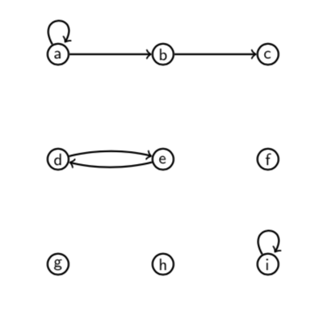
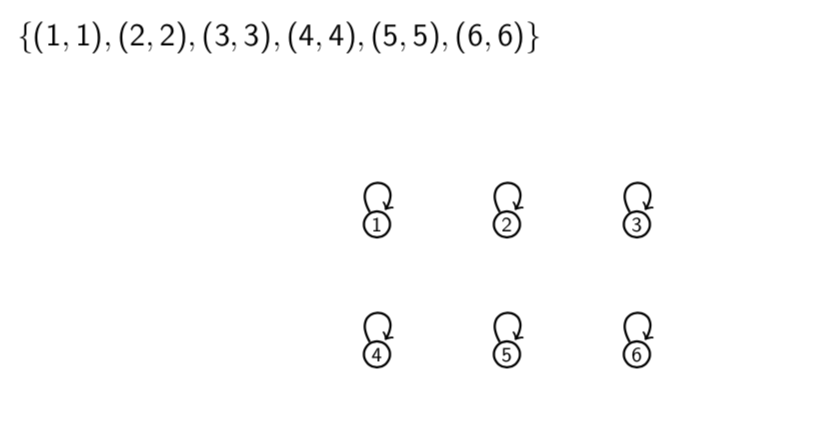

# Lecture 16: Relations

**Relations - why should you care?**

- Relations are used heavily in database theory in computer science.
- They are also used in theories of object orientation in programming.
- Relations can be thought of as a generalisation of functions.
- Like there is a functional programming paradigm there's a relational
  programming paradigm.

Roughly speaking, a binary relation on a set is something that tells us, for
any two things in the set, that they are related or they are not related. (Order
_is_ important.)

We could make a set $\{(x,y): x \text{ links to } y \}$.

Mathematical objects can be related in various ways, and any particular way of
relating objects is called a _relation_ on the set of objects in question.

(This also applies to relations in the everyday sense. For example, "parent of"
is a relation on the set of people.)

A _binary relation_ $R$ on a set $A$ consists of $A$ and a set of ordered pairs
from $A \times A$. When $(a,b)$ is in this set we write $aRb$.

Similarly, a _ternary_ relation on $A$ would be defined by a set of ordered
triples from $A \times A \times A$, and so on. (A _unary_ relation on $A$ is
just a subset of $A$.)

A binary relation $R$ on a set $A$ consists of the set $A$ together with a set
of ordered pairs from $A \times A$.

If $(x,y)$ is in the set then we write $xRy$ and say "x is R-related to y".

If $(x,y)$ is not in the set then we write $x \not R y$.

Order matters. It might be that $xRy$ but $y \not R x$.

**Arrow diagrams**

**Example** Let $R$ be the relation on $\{a,b,c,d,e,f,g,h,i\}$ given by the set
$\{(a,a),(a,b),(b,c),(d,e),(e,d),(i,i)\}$.

- Is $bRc$? **Yes**
- Is $eRf$? **No**
- Is $aRc$? **No**
- Is $dRe$? **Yes**
- Is $iRi$? **Yes**

## 16.1 Relations and functions

Any function $f: X \rightarrow Y$ can be viewed as a relation $R$ on $X \cup
Y$. The relation is defined by $xRy$ if and only if $y=f(x)$.

However, not every relation is a function. Remember that a function must have
exactly one output $y$ for each input $x$ in its domain. In a relation, on the
other hand, and element $x$ may be related to many elements $y$, or to none at
all.

## 16.2 Examples

**Question** Give the set of ordered pairs for the relation "=" on
$\{1,2,3,4,5,6\}$ and draw an arrow diagram of it.

**Question** Give the set of orders pairs for the relation $"<"$ on
$\{1,2,3,4,5,6\}$ and draw an arrow diagram of it.
