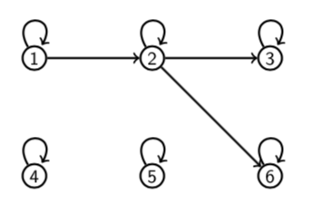
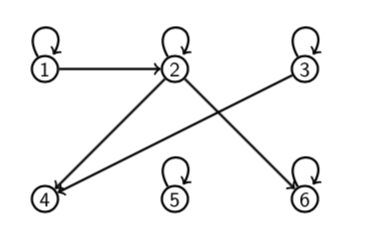
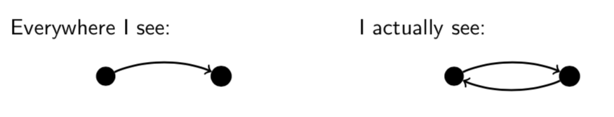
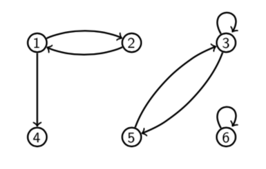
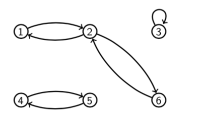
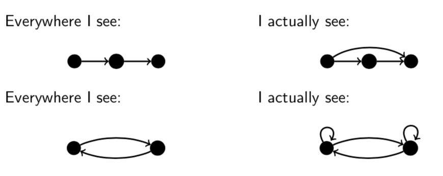
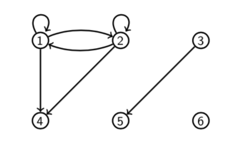
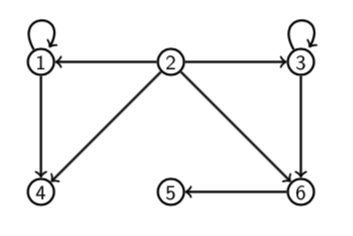
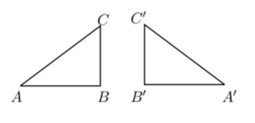
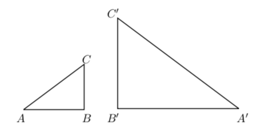

# Lecture 17: Equivalence Relations

An _equivalence relation_  on a set  is a binary relation with the
following three properties.

1. Reflexivity:  for all .
2. Symmetry:  for all .
3. Transitivity:  and  for all .

Equality and congruence mod  (for fixed ) are examples of equivalence
relations.

**Reflexivity** (For a binary relation  on a set ).

To prove that  is reflexive, show that; For all 

To prove that  is not reflexive, show that; There is an  such that
.

**Question** Let  be the relation on  pictured below. Is  reflexive?

Yes.  for all .

**Question** Let  be the relation on  pictured below. Is  reflexive?

No. .

**Symmetry** (For a binary relation  on a set .)

To prove  is symmetric, show that; For all , if  then
.

To prove  is not symmetric, show that; There are some  such that
 but .

**Question** Let  be the relation on  pictured below. Is  symmetric?

No.  but .

**Question** Let  be the relation on  pictured below. Is  symmetric?

Yes. For all  if  then .

**Transitivity** (For a binary relation  on a set .)

To prove that  is transitive, show that; For all , if  and
 then .

To prove that  is not transitive, show that; There are some 
such that  and  but .

**Question** Let  be the relation on  pictured below. Is  transitive?

Yes. For all , if  and  then .

**Question** Let  be the relation on  pictured below. Is  transitive?

No, because  and  but .

## 17.1 Other equivalence relations

### 1. Equivalence of fractions.

Two fractions are equivalent if they reduce to the same fraction when the
numerator and denominator of each are divided by their gcd. E.g. 
and  are equivalent because both reduce to .

### 2. Congruence of triangles.

Triangles  and  are congruent if  and . E.g. The following triangles are congruent.

### 3. Similarity of triangles

Triangles  and  are similar if

E.g. the following triangles are similar

### 4. Parallelism of lines

The relation  (L is parallel to M) is an equivalence relation.

## Remark

In all of these cases the relation is an equivalence because it says that
objects are the _same_ in some respect.

1. Equivalent fractions have the same reduced form.
2. Congruent triangles have the same side lengths.
3. Similar triangles have the same shape.
4. Parallel lines have the same direction.

Sameness is always reflexive (a is the same as a), symmetric (if a is the same
as b, then b is the same as a) and transitive (if a is the same as b and b is
the same as c, then a is the same as c).

**Question** Which of the following relations are equivalence relations on
?

1.  defined by  if and only if 
2.  defined by  if and only if 
3.  defined by  if and only if  divides 
4.  defined by  if and only if 5 divides 

- **A** Just (1) and (3)
- **B** Just (1)
- **C** Just (1) and (4)
- **D** Just (1), (2) and (4)

**Answer**

- (2) is not reflexive. E.g.  because . So (2)
  is not an equivalence relation.
- (3) is not symmetric. E.g.  but  (3 divides 6 but 6 doesn't
  divide 3). So (3) is not an equivalence relation.
- (1) and (4) are equivalence relations. So **C**.

(1)  defined by  if and only if 

- Reflexive: Yes.  for all .
- Symmetric: Yes. If , then  for all .
- Transitive: Yes. If  and , then  for all
  .
- So it is an equivalence relation.

(2)  defined by  if and only if 

- Reflexive: No.  so .
- Symmetric: No.  but , so  but .
- Transitive: No.  and  but , so  and  but .
- So it is not an equivalence relation.

(3)  defined by  if and only if  divides 

- Reflexive: No. a divides a for all .
- Symmetric: No. 3 divides 6 but 6 does not divide 3, so  but .
- Transitive: No. If a divides b and b divides c, then a divides c for all
  
- So it is not an equivalence relation.

(4)  defined by  if and only if 5 divides 

Yes. This relation sit the same as  (mod 5) and we know that's an
equivalence relation.

**Question** What is the same about the equivalent objects for the equivalence
relations (1) and (4)?

- (1)  defined on  by  if and only if 
  - _x_ and _y_ have the same "magnitude".
- (4)  defined on  by  if and only if 5 divides 
  - _x_ and _y_ have the same remainder when divided by 5.

## 17.2 Equivalence classes

Conversely, we can show that if  is a reflexive, symmetric and transitive
relation then  says that  and  are the same in some respect: _they
have the same R-equivalence class_.

If  is an equivalence relation we define the _R-equivalence class_ of  to
be

Thus  consists of all the elements relate to . It can also be defined as
, because  if and only if , by symmetry of .

**Examples**

- The parallel equivalence class of a line  consists of all lines parallel to
  .
- The equivalence class of 1 for congruence mod 2 is the set of all odd numbers.

## 17.3 Equivalence class properties

**Claim.** _If two elements are related by an equivalence relation R on a set A,
their equivalence classes are equal._

**Proof.** Suppose  and . Now

Thus all elements of  belong to . Similarly, all elements of 
belong to , hence .
