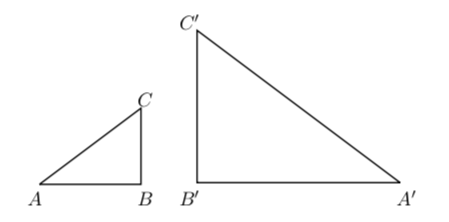

# Lecture 17: Equivalence Relations

An _equivalence relation_ $R$ on a set $A$ is a binary relation with the
following three properties.

1. Reflexivity: $aRA$ for all $a \in A$.
2. Symmetry: $aRb \Rightarrow bRa$ for all $a,b \in A$.
3. Transitivity: $aRb$ and $bRc \Rightarrow aRc$ for all $a,b,c \in A$.

Equality and congruence mod $n$ (for fixed $n$) are examples of equivalence
relations.

**Reflexivity** (For a binary relation $R$ on a set $A$).

To prove that $R$ is reflexive, show that; For all $x \in A, xRx$

To prove that $R$ is not reflexive, show that; There is an $x \in A$ such that
$x \not R x$.

**Question** Let $R$ be the relation on $A$ pictured below. Is $R$ reflexive?

Yes. $xRx$ for all $x \in A$.

**Question** Let $S$ be the relation on $A$ pictured below. Is $S$ reflexive?

No. $4 \not S 4$.

**Symmetry** (For a binary relation $R$ on a set $A$.)

To prove $R$ is symmetric, show that; For all $x, y \in A$, if $xRy$ then
$yRx$.

To prove $R$ is not symmetric, show that; There are some $x,y \in A$ such that
$xRy$ but $y \not R x$.

**Question** Let $R$ be the relation on $A$ pictured below. Is $R$ symmetric?

No. $1R4$ but $4 \not R 1$.

**Question** Let $S$ be the relation on $A$ pictured below. Is $S$ symmetric?

Yes. For all $x,y \in A$ if $xSy$ then $ySx$.

**Transitivity** (For a binary relation $R$ on a set $A$.)

To prove that $R$ is transitive, show that; For all $x,z,z \in A$, if $xRy$ and
$yRz$ then $xRz$.

To prove that $RF$ is not transitive, show that; There are some $x,y,z \in A$
such that $xRy$ and $yRz$ but $x \not R z$.

**Question** Let $R$ be the relation on $A$ pictured below. Is $R$ transitive?

Yes. For all $x,y,z \in A$, if $xRy$ and $yRz$ then $xRz$.

**Question** Let $S$ be the relation on $A$ pictured below. Is $S$ transitive?

No, because $3S6$ and $6S5$ but $3 \not S 5$.

## 17.1 Other equivalence relations

### 1. Equivalence of fractions.

Two fractions are equivalent if they reduce to the same fraction when the
numerator and denominator of each are divided by their gcd. E.g. $\frac{2}{4}$
and $\frac{3}{6}$ are equivalent because both reduce to $\frac{1}{2}$.

### 2. Congruence of triangles.

Triangles $ABC$ and $A'B'C'$ are congruent if $AB = A'B, BC = B'C'$ and $CA =
C'A'$. E.g. The following triangles are congruent.

### 3. Similarity of triangles

Triangles $ABC$ and $A'B'C'$ are similar if

$$\frac{AB}{A'B'} = \frac{BC}{B'C'} = \frac{CA}{C'A'}$$

E.g. the following triangles are similar

### 4. Parallelism of lines

The relation $L||M$ (L is parallel to M) is an equivalence relation.

## Remark

In all of these cases the relation is an equivalence because it says that
objects are the _same_ in some respect.

1. Equivalent fractions have the same reduced form.
2. Congruent triangles have the same side lengths.
3. Similar triangles have the same shape.
4. Parallel lines have the same direction.

Sameness is always reflexive (a is the same as a), symmetric (if a is the same
as b, then b is the same as a) and transitive (if a is the same as b and b is
the same as c, then a is the same as c).

**Question** Which of the following relations are equivalence relations on
$\mathbb{Z}$?

1. $R$ defined by $xRy$ if and only if $|x| = |y|$
2. $S$ defined by $xSy$ if and only if $x^3 - y^3 = 1$
3. $T$ defined by $xTu$ if and only if $x$ divides $y$
4. $U$ defined by $xUy$ if and only if 5 divides $x-y$

- **A** Just (1) and (3)
- **B** Just (1)
- **C** Just (1) and (4)
- **D** Just (1), (2) and (4)

**Answer**

- (2) is not reflexive. E.g. $1 \not S 1$ because $1^3 - 1^3 \not = 1$. So (2)
  is not an equivalence relation.
- (3) is not symmetric. E.g. $3T6$ but $6\not T 3$ (3 divides 6 but 6 doesn't
  divide 3). So (3) is not an equivalence relation.
- (1) and (4) are equivalence relations. So **C**.

(1) $R$ defined by $xRy$ if and only if $|x| = |y|$

- Reflexive: Yes. $|a| = |a|$ for all $a \in \mathbb{Z}$.
- Symmetric: Yes. If $|a| = |b|$, then $|b| = |a|$ for all $a,b \in \mathbb{Z}$.
- Transitive: Yes. If $|a| = |b|$ and $|b| = |c|$, then $|a| = |c|$ for all
  $a,b,c \in \mathbb{Z}$.
- So it is an equivalence relation.

(2) $S$ defined by $xSy$ if and only if $x^3 - y^3 = 1$

- Reflexive: No. $1^3 - 1^3 \not = 1$ so $1 \not S 1$.
- Symmetric: No. $1^3 - 1^3 = 1$ but $0^3 - 1^3 \not = 1$, so $1S0$ but $0 \not
  S1$.
- Transitive: No. $1^3 - 0^3 = 1$ and $0^3 - (-1)^3 = 1$ but $1^3 - (-1)^3 \not
  = 1$, so $1S0$ and $0S(-1)$ but $1 \not S(-1)$.
- So it is not an equivalence relation.

(3) $T$ defined by $xTu$ if and only if $x$ divides $y$

- Reflexive: No. a divides a for all $a \in \mathbb{Z}$.
- Symmetric: No. 3 divides 6 but 6 does not divide 3, so $3T6T$ but $6 \not T
  3$.
- Transitive: No. If a divides b and b divides c, then a divides c for all
  $a,b,c \in \mathbb{Z}$
- So it is not an equivalence relation.

(4) $U$ defined by $xUy$ if and only if 5 divides $x-y$

Yes. This relation sit the same as $x \equiv y$ (mod 5) and we know that's an
equivalence relation.

**Question** What is the same about the equivalent objects for the equivalence
relations (1) and (4)?

- (1) $R$ defined on $\mathbb{Z}$ by $xRy$ if and only if $|x| = |y|$
  - _x_ and _y_ have the same "magnitude".
- (4) $U$ defined on $\mathbb{Z}$ by $xUy$ if and only if 5 divides $x-y$
  - _x_ and _y_ have the same remainder when divided by 5.

## 17.2 Equivalence classes

Conversely, we can show that if $R$ is a reflexive, symmetric and transitive
relation then $aRb$ says that $a$ and $b$ are the same in some respect: _they
have the same R-equivalence class_.

If $R$ is an equivalence relation we define the _R-equivalence class_ of $a$ to
be

$$[a] = \{s: sRa \}$$

Thus $[a]$ consists of all the elements relate to $a$. It can also be defined as
$\{s: aRs\}$, because $sRa$ if and only if $aRs$, by symmetry of $R$.

**Examples**

- The parallel equivalence class of a line $L$ consists of all lines parallel to
  $L$.
- The equivalence class of 1 for congruence mod 2 is the set of all odd numbers.

## 17.3 Equivalence class properties

**Claim.** _If two elements are related by an equivalence relation R on a set A,
their equivalence classes are equal._

**Proof.** Suppose $a,b \in A$ and $aRb$. Now

$$
\begin{align}
  s \in [a] &\Rightarrow sRa \text{ by definition of } [a] \\
  &\Rightarrow sRb \text{ by transitivity of } R \\
  & \text{ since } sRa \text{ and } aRb \\
  &\Rightarrow s \in [b] \text{ by definition of } [b].
\end{align}
$$

Thus all elements of $[a]$ belong to $[b]$. Similarly, all elements of $[b]$
belong to $[a]$, hence $[a] = [b]$.$\qedhere$

**Claim.** _If R is an equivalence relation on a set A, each element of A
belongs to to exactly one equivalence class._

**Proof.** Suppose $a,b,c \in A$, and $c \in [a] \cap [b]$.

$$
\begin{align}
  & c \in [a] \text{ and } c \in [b] \\
  & \Rightarrow cRa \text{ and } cRb \\
  & \text{ by definition of } [a] \text{ and } [b] \\
  & \Rightarrow aRc \text{ and } cRb \text{ by symmetry} \\
  & \Rightarrow aRb \text{ by transitivity } \\
  & \Rightarrow [a] = [b] \\
  & \text{ by the previous claim.}
\end{align}
$$

## 17.4 Partitions and equivalence classes

A _partition_ of a set $S$ is a set of subsets of $S$ such that each element of
$S$ is in exactly one of the subsets.

Using what we showed in the last section, we have the following.

If $R$ is an equivalence relation on the set $A$, then the equivalence classes
of $R$ from a partition of $A$. Two elements of $A$ are related if and only if
they are in the same equivalence class.

**Example.** Let $R$ be the relation on $\mathbb{Z}$ defined by $aRb$ if and
only if $a \equiv b$ (mod 3). The three equivalence classes of $R$ are

$$
\begin{align}
  \{x: x \equiv 0 (\text{ mod } 3) \} &= \{3k: k \in \mathbb{Z} \} \\
  \{x: x \equiv 1 (\text{ mod } 3) \} &= \{3k + 1: k \in \mathbb{Z} \} \\
  \{x: x \equiv 2 (\text{ mod } 3) \} &= \{3k + 2: k \in \mathbb{Z} \}
\end{align}
$$

These partition the set $\mathbb{Z}$.

**Examples of partitions**

$\{\{1,6\}, \{2\}, \{3,4,5\}\}$ is a partition of $\{1,2,3,4,5,6\}$.

$\{\{x: x \in \mathbb{Z}$ and $x$ is even $\}, \{x: x \in \mathbb{Z}$ and $x$ is
odd $\}\}$ is a partition of $\mathbb{Z}$.

**Question** What are the equivalence classes of the equivalence relations (1)
and (4)?

(1) $R$ defined on $\mathbb{Z}$ by $xRy$ if and only if $|x|=|y|$

$$\{0\}, \{1, -1\}, \{2, -2\}, \{3, -3\}, \dots$$

(4) $U$ defined on $\mathbb{Z}$ by $xUy$ if and only if 5 divides $x−y$

$$\{ \dots,-10,-5,0,5,10, \dots \},$$
$$\{ \dots,-9,-4,1,6,11, \dots \},$$
$$\{ \dots,-8,-3,2,7,12, \dots \},$$
$$\{ \dots,-7,-2,3,8,13, \dots \},$$
$$\{ \dots,-6,-1,4,9,14, \dots \}$$
