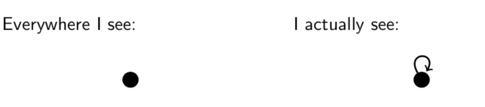
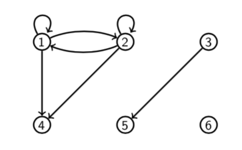
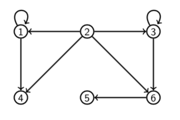

# Lecture 17: Equivalence Relations

An _equivalence relation_ $R$ on a set $A$ is a binary relation with the
following three properties.

1. Reflexivity: $aRA$ for all $a \in A$.
2. Symmetry: $aRb \Rightarrow bRa$ for all $a,b \in A$.
3. Transitivity: $aRb$ and $bRc \Rightarrow aRc$ for all $a,b,c \in A$.

Equality and congruence mod $n$ (for fixed $n$) are examples of equivalence
relations.

**Reflexivity** (For a binary relation $R$ on a set $A$).

To prove that $R$ is reflexive, show that; For all $x \in A, xRx$

To prove that $R$ is not reflexive, show that; There is an $x \in A$ such that
$x \not R x$.

**Question** Let $R$ be the relation on $A$ pictured below. Is $R$ reflexive?

Yes. $xRx$ for all $x \in A$.

**Question** Let $S$ be the relation on $A$ pictured below. Is $S$ reflexive?

No. $4 \not S 4$.

**Symmetry** (For a binary relation $R$ on a set $A$.)

To prove $R$ is symmetric, show that; For all $x, y \in A$, if $xRy$ then
$yRx$.

To prove $R$ is not symmetric, show that; There are some $x,y \in A$ such that
$xRy$ but $y \not R x$.

**Question** Let $R$ be the relation on $A$ pictured below. Is $R$ symmetric?

No. $1R4$ but $4 \not R 1$.

**Question** Let $S$ be the relation on $A$ pictured below. Is $S$ symmetric?

Yes. For all $x,y \in A$ if $xSy$ then $ySx$.

**Transitivity** (For a binary relation $R$ on a set $A$.)

To prove that $R$ is transitive, show that; For all $x,z,z \in A$, if $xRy$ and
$yRz$ then $xRz$.

To prove that $RF$ is not transitive, show that; There are some $x,y,z \in A$
such that $xRy$ and $yRz$ but $x \not R z$.

**Question** Let $R$ be the relation on $A$ pictured below. Is $R$ transitive?

Yes. For all $x,y,z \in A$, if $xRy$ and $yRz$ then $xRz$.

**Question** Let $S$ be the relation on $A$ pictured below. Is $S$ transitive?

No, because $3S6$ and $6S5$ but $3 \not S 5$.

## 17.1 Other equivalence relations

### 1. Equivalence of fractions.

Two fractions are equivalent if they reduce to the same fraction when the
numerator and denominator of each are divided by their gcd. E.g. $\frac{2}{4}$
and $\frac{3}{6}$ are equivalent because both reduce to $\frac{1}{2}$.

### 2. Congruence of triangles.

Triangles $ABC$ and $A'B'C'$ are congruent if $AB = A'B, BC = B'C'$ and $CA =
C'A'$. E.g. The following triangles are congruent.

### 3. Similarity of triangles

Triangles $ABC$ and $A'B'C'$ are similar if

$$\frac{AB}{A'B'} = \frac{BC}{B'C'} = \frac{CA}{C'A'}$$

E.g. the following triangles are similar

### 4. Parallelism of lines

The relation $L||M$ (L is parallel to M) is an equivalence relation.

## Remark

In all of these cases the relation is an equivalence because it says that
objects are the _same_ in some respect.

1. Equivalent fractions have the same reduced form.
2. Congruent triangles have the same side lengths.
3. Similar triangles have the same shape.
4. Parallel lines have the same direction.

Sameness is always reflexive (a is the same as a), symmetric (if a is the same
as b, then b is the same as a) and transitive (if a is the same as b and b is
the same as c, then a is the same as c).

**Question** Which of the following relations are equivalence relations on
$\mathbb{Z}$?

1. $R$ defined by $xRy$ if and only if $|x| = |y|$
2. $S$ defined by $xSy$ if and only if $x^3 - y^3 = 1$
3. $T$ defined by $xTu$ if and only if $x$ divides $y$
4. $U$ defined by $xUy$ if and only if 5 divides $x-y$

- **A** Just (1) and (3)
- **B** Just (1)
- **C** Just (1) and (4)
- **D** Just (1), (2) and (4)

**Answer**

- (2) is not reflexive. E.g. $1 \not S 1$ because $1^3 - 1^3 \not = 1$. So (2)
  is not an equivalence relation.
- (3) is not symmetric. E.g. $3T6$ but $6\not T 3$ (3 divides 6 but 6 doesn't
  divide 3). So (3) is not an equivalence relation.
- (1) and (4) are equivalence relations. So **C**.
