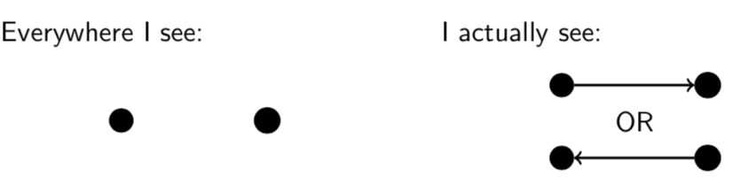

# Lecture 18: Order Relations

## 18.1 Partial order relations

A _partial order relation R_ on a set _A_ is a binary relation with the
following three properties.

1. Reflexivity.  for all .
2. Antisymmetry.  and  for all .
3. Transitivity.  and  for all .

For a binary relation  on a set .

**Antisymmetry:** For all , if  then .

This definition is useful for proofs but I think the contrapositive is more
intuitive.

**Antisymmetry (equivalent dfn):** For all , if  then it
is not the case that  and .

**Antisymmetry** (For a binary relation _R_ on a set _A_)

To prove _R_ is antisymmetric, show that; For all , if  and
 then .

To prove _R_ is not antisymmetric, show that; There is some  such
that  and .

**Warning** Antisymmetric does not mean "not symmetric"!

**Question** Let _R_ be the relation _A_ pictured below. Is _R_ antisymmetric?

Yes. For all , if  and  then .

**Question** Let _S_ be the relation _A_ pictured below. Is _S_ antisymmetric?

No.  and  (and .

**Examples.**

1.  on 
  Reflexive:  for all .
  Antisymmetric:  and  for all, .
  Transitive:  and  for all .
2.  on .
  Reflexive:  for all .
  Antisymmetric:  and  for all
  .
  Transitive:  and  for
  all .
3. Divisibility on .
  The relation "_a_ divides _b_" on natural numbers is reflexive, antisymmetric
  and transitive.
4. Alphabetical order of words.
  Words on the English alphabet are alphabetically ordered by comparing the
  leftmost letter at which they differ.

**Definition** A binary relation _R_ on a set _A_ is a _total order relation_
if:

- it is a partial order relation; and
- for any  we have  or .

**Example**  on  is a total order relation (because for any
 we have that  or ).

**Example**  on  is not a total order relation (for
example,  and ).

## 18.2 Total order relations

A total order relation is a special kind of partial order relation that "puts
everything in order".

A _total order relation R_ on a set _A_ is a partial order relation that also
has the property  or  for all .

**Examples.**

1. .
  This is a total order relation because for all real numbers _a_ and _b_ we
  have  or .
2.  on .
  This is not a total order because, for example,  and .
3. Divisibility on .
  This is not a total order because, for example, 2 does not divide 3 and 3 does
  not divide 2.
4. Alphabetical order of words.
  This is a total order because given any two different words, one will appear
  before the other in alphabetical order.

**Question** Let _R_ be the partial order relation on  defined by  if and only if  and
. Is _R_ a total order?

- **A.** No because  and .
- **B.** No because  and .
- **C.** No because  and .
- **D.** Yes because  or  for any
  .

**Examples**

 because  and 

 because  and 

**Answer**

- **B** is silly; to show something is not a total order we must find two things
  that are not related in either direction.
- **C** is wrong because .
- **A** gives a correct example of why _R_ is not a total order. So **A**.
- (The example in _A_, of course, shows that _D_ is wrong.)

**Hasse Diagrams**

**Example** The relation  on  is a partial order
relation.

## 18.3 Hasse diagrams

A partial order relation _R_ on a finite set _A_ can be represented as a Hasse
diagram. The elements of _A_ are written on the page and connected by lines so
that, for any  exactly when _b_ can be reached _a_ by travelling
upward along the lines.

**Question 18.2** Draw a Hasse diagram for the set of divisors of 42.

The set of divisors is .

## 18.4 Well-ordering

**Definition** A binary relation _R_ on a set _A_ is a _well-order relation_ if

- it is a total order relation; and
- every non-empty  has a least element.

We could write this second condition formally as

- for every non-empty  there is an  such that  for
  all .

**Example**  on  is a well-order relation (because every
non-empty set of natural numbers has a least element).

**Example**  on  is a not well-order relation (for example,
the set  has no least element).
