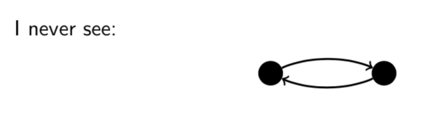

# Lecture 18: Order Relations

## 18.1 Partial order relations

A _partial order relation R_ on a set _A_ is a binary relation with the
following three properties.

1. Reflexivity.  for all .
2. Antisymmetry.  and  for all .
3. Transitivity.  and  for all .

For a binary relation  on a set .

**Antisymmetry:** For all , if  then .

This definition is useful for proofs but I think the contrapositive is more
intuitive.

**Antisymmetry (equivalent dfn):** For all , if  then it
is not the case that  and .

**Antisymmetry** (For a binary relation _R_ on a set _A_)

To prove _R_ is antisymmetric, show that; For all , if  and
 then .

To prove _R_ is not antisymmetric, show that; There is some  such
that  and .

**Warning** Antisymmetric does not mean "not symmetric"!

**Question** Let _R_ be the relation _A_ pictured below. Is _R_ antisymmetric?

Yes. For all , if  and  then .

**Question** Let _S_ be the relation _A_ pictured below. Is _S_ antisymmetric?

No.  and  (and .
