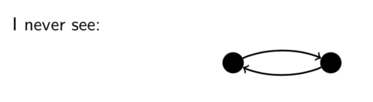

# Lecture 18: Order Relations

## 18.1 Partial order relations

A _partial order relation R_ on a set _A_ is a binary relation with the
following three properties.

1. Reflexivity. $aRa$ for all $a \in A$.
2. Antisymmetry. $aRb$ and $bRa \Rightarrow a = b$ for all $a,b \in A$.
3. Transitivity. $aRb$ and $bRc \Rightarrow aRc$ for all $a,b,c \in A$.

For a binary relation $R$ on a set $A$.

**Antisymmetry:** For all $x,y \in A$, if $yRx$ then $x=y$.

This definition is useful for proofs but I think the contrapositive is more
intuitive.

**Antisymmetry (equivalent dfn):** For all $x,y \in A$, if $x \not = y$ then it
is not the case that $xRy$ and $yRx$.

**Antisymmetry** (For a binary relation _R_ on a set _A_)

To prove _R_ is antisymmetric, show that; For all $x,y \in A$, if $xRy$ and
$yRx$ then $x=y$.

To prove _R_ is not antisymmetric, show that; There is some $x,y \in A$ such
that $x \not = y, xRy$ and $yRx$.
