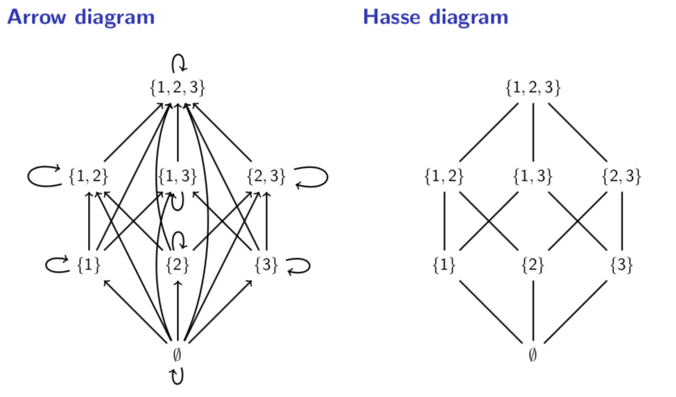

# Lecture 18: Order Relations

## 18.1 Partial order relations

A _partial order relation R_ on a set _A_ is a binary relation with the
following three properties.

1. Reflexivity. $aRa$ for all $a \in A$.
2. Antisymmetry. $aRb$ and $bRa \Rightarrow a = b$ for all $a,b \in A$.
3. Transitivity. $aRb$ and $bRc \Rightarrow aRc$ for all $a,b,c \in A$.

For a binary relation $R$ on a set $A$.

**Antisymmetry:** For all $x,y \in A$, if $yRx$ then $x=y$.

This definition is useful for proofs but I think the contrapositive is more
intuitive.

**Antisymmetry (equivalent dfn):** For all $x,y \in A$, if $x \not = y$ then it
is not the case that $xRy$ and $yRx$.

**Antisymmetry** (For a binary relation _R_ on a set _A_)

To prove _R_ is antisymmetric, show that; For all $x,y \in A$, if $xRy$ and
$yRx$ then $x=y$.

To prove _R_ is not antisymmetric, show that; There is some $x,y \in A$ such
that $x \not = y, xRy$ and $yRx$.

**Warning** Antisymmetric does not mean "not symmetric"!

**Question** Let _R_ be the relation _A_ pictured below. Is _R_ antisymmetric?

Yes. For all $x,y \in A$, if $xRy$ and $yRx$ then $x=y$.

**Question** Let _S_ be the relation _A_ pictured below. Is _S_ antisymmetric?

No. $3S5$ and $5S3$ (and $3 \not = 5)$.

**Examples.**

1. $\leq$ on $\mathbb{R}$
  Reflexive: $a \leq a$ for all $a \in \mathbb{R}$.
  Antisymmetric: $a \leq b$ and $b \leq a \Rightarrow a = b$ for all, $a,b \in
  \mathbb{R}$.
  Transitive: $a \leq b$ and $b \leq c \Rightarrow a \leq c$ for all $a,b,c \in
  \mathbb{R}$.
2. $\subseteq$ on $\wp(\mathbb{N})$.
  Reflexive: $A \subseteq A$ for all $a \in \wp(\mathbb{N})$.
  Antisymmetric: $A \subseteq B$ and $B \subseteq A \Rightarrow A = B$ for all
  $A,B \in \pw(\mathbb{N})$.
  Transitive: $A \subseteq B$ and $B \subseteq C \Rightarrow A \subseteq C$ for
  all $A,B,C \in \wp(\mathbb{N})$.
3. Divisibility on $\mathbb{N}$.
  The relation "_a_ divides _b_" on natural numbers is reflexive, antisymmetric
  and transitive.
4. Alphabetical order of words.
  Words on the English alphabet are alphabetically ordered by comparing the
  leftmost letter at which they differ.

**Definition** A binary relation _R_ on a set _A_ is a _total order relation_
if:

- it is a partial order relation; and
- for any $x,y \in A$ we have $xRy$ or $yRx$.

**Example** $\leq$ on $\mathbb{R}$ is a total order relation (because for any
$x,y \in \mathbb{R}$ we have that $x \leq y$ or $y \leq x$).

**Example** $\subseteq$ on $\wp(\{1,2,3\})$ is not a total order relation (for
example, $\{1\} \not \subseteq \{2,3\}$ and $\{2,3\} \not \subseteq
\{1\}$).

## 18.2 Total order relations

A total order relation is a special kind of partial order relation that "puts
everything in order".

A _total order relation R_ on a set _A_ is a partial order relation that also
has the property $aRb$ or $bRa$ for all $a,b \in A$.

**Examples.**

1. $\leq \text{ and } \mathbb{R}$.
  This is a total order relation because for all real numbers _a_ and _b_ we
  have $a \leq b$ or $b \leq a$.
2. $\subseteq$ on $\wp(\mathbb{N})$.
  This is not a total order because, for example, $\{1,2\} \not \subseteq
  \{1,3\}$ and $\{1,3\} \not \subseteq \{1,2\}$.
3. Divisibility on $\mathbb{N}$.
  This is not a total order because, for example, 2 does not divide 3 and 3 does
  not divide 2.
4. Alphabetical order of words.
  This is a total order because given any two different words, one will appear
  before the other in alphabetical order.

**Question** Let _R_ be the partial order relation on $\mathbb{N} \times
\mathbb{N}$ defined by $(m_1, n_1)R(m_2, n_2)$ if and only if $m_1 \leq m_2$ and
$n_1 \leq n_2$. Is _R_ a total order?

- **A.** No because $(1,4) \not R (2,2)$ and $(2,2) \not R (1,4)$.
- **B.** No because $(2,3) \not R (2,2)$ and $(2,2) R (2,3)$.
- **C.** No because $(1,4) \not R (2,8)$ and $(2,8) \not R (1,4)$.
- **D.** Yes because $(a_1,b_1) R (a_2,b_2)$ or $(a_2,b_2) R (a_1,b_1)$ for any
  $(a_1, b_1), (a_2, b_2) \in \mathbb{N} \times \mathbb{N}$.

**Examples**

$(2,3)R(5,4)$ because $2 \leq 5$ and $3 \leq 4$

$(2,3) \not R(5,2)$ because $2 \leq 5$ and $3 > 2$

**Answer**

- **B** is silly; to show something is not a total order we must find two things
  that are not related in either direction.
- **C** is wrong because $(1,4) R(2,8)$.
- **A** gives a correct example of why _R_ is not a total order. So **A**.
- (The example in _A_, of course, shows that _D_ is wrong.)

**Hasse Diagrams**

**Example** The relation $\subseteq$ on $\wp(\{1,2,3\})$ is a partial order
relation.

## 18.3 Hasse diagrams

A partial order relation _R_ on a finite set _A_ can be represented as a Hasse
diagram. The elements of _A_ are written on the page and connected by lines so
that, for any $a,b \in A, aRb$ exactly when _b_ can be reached _a_ by travelling
upward along the lines.
