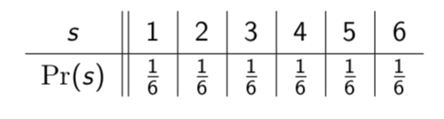

# Lecture 21: Probability and Independence

Why should you care?

- Many algorithms work better if they make random choices. For example,
  "quicksort" can avoid its worst case by making random choices. The Pollard-p
  factorisation algorithm makes random choices as it searches for integer
  factors. To understand such algorithms you must understand probability.
- Many mathematical objects can only be constructed randomly. For example,
  graphs with large chromatic number but no short cycles.
- Random models are useful for studying the structure of real world networks.
  And of traffic modelling on them.
- Probability also helps in machine learning, reliability modelling, simulation
  algorithms, data mining, speech recognition, etc.

Probability gives us a way to model random processes mathematically. These
processes could be anything from the rolling of dice, to radioactive decay of
atoms, to the performance of a stock market index. The mathematical environment
we work in when dealing with probabilities is called a probability space.

## Probability spaces

A _probability space_ consists of:

- a set  called a _sample space_ which contains all the possible _outcomes_
  of the random process; and
- a _probability_ function  such that the sum of the
  probabilities of the outcomes in  is 1.

Each time the process occurs it should produce exactly one outcome (never zero
or more than one). The probability of an outcome is a measure of the likeliness
that it will occur. It is given as a real number between 0 and 1 inclusive,
where 0 indicates that the outcome cannot occur and 1 indicates that the outcome
must occur.

**Example** Rolling a fair six-sided die could be modelled by a probability
space with sample space  and probability function 
given as follows.

A sample space like this one where every outcome has an equal probability is
sometimes called a _uniform sample space_. Outcomes from a uniform sample space
are said to have been take _uniformly at random._

## Events

An _event_ is a subset of the sample space.

**Example** In the die rolling example with , we could
define the event of rolling at least a 3. Formally, this would be the set
. We could also define the event of rolling an odd number as the
set .

The probability of an event  is the sum of the probabilities of the outcomes
in .

## Operations on events

Because events are defined as sets we can perform set operations on them. If 
and  are events for a sample space , then

-  is the event "A or B"
-  is the event "A and B"
-  is the event "not A"

We always take the sample space as our universal set, so  means .

**Exercise** If  and  are any two events then 

- **A** 
- **B** 
- **C** 
- **D** 
- **E** 

**ANS: E** In general  depends on the events _A_ and _B_, but the
only thing you can be sure of is that it is no more than the probability of
either of the individual events.
