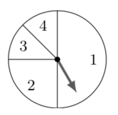

# Lecture 22: Conditional probability and Bayes' theorem

## Conditional probability

Conditional probabilities measure the likelihood of an event, given that some
other event occurs.

For events _A_ and _B_, the _conditional probability of A given B_ is

$$\Pr(A|B) = \frac{\Pr(A \cap B)}{\Pr(B)}$$

This definition also implies that $\Pr(A \cap B) = \Pr(A|B)\Pr(B)$.

**Example** A spinner is spun. Let _A_ be the event that the result was at least
3 and _B_ be the event that the result was even. What is $\Pr(A|B)$?

- $\Pr(A \cap B) = \Pr(4) = \frac{1}{8}$
- $\Pr(B) = \Pr(2) + \Pr(4) = \frac{1}{4} + \frac{1}{8} = \frac{3}{8}$
- Thus, $\Pr(A|B) = \frac{\Pr(A \cap B)}{\Pr(B)} =
  \frac{\frac{1}{8}}{\frac{3}{8}} = \frac{1}{3}$.

**Example** A binary string of length 6 is generated uniformly at random. Let
_A_ be the event that is the first bit is a 1 and _B_ be the event that the
string contains two 1s. What is $\Pr(A|B)$?

There are $2^6$ strings in our sample space. Now $A \cap B$ occurs when the
first bit is a 1 and the rest of the string contains one 1. There are
$\binom{5}{1}$ such strings and so $\Pr(A \cap B) = \frac{\binom{5}{1}}{2^6}$.
Also, there are $\binom{6}{2}$ strings containing two 1s and so $\Pr(B) =
\frac{\binom{6}{2}}{2^6}$. Thus,

$$\Pr(A|B) = \frac{\Pr(A \cap B)}{\Pr(B)} = \frac{\binom{5}{1}}{\binom{6}{2}} =
\frac{1}{3}$$

**Exercise** A normal die is rolled. Let _A_ be the event that the result is an
odd number. Let _B_ be the event that the result is a square number.

- **A:** $\Pr(A|B) = \frac{1}{2}$ and $\Pr(B|A) = \frac{1}{4}$
- **B:** $\Pr(A|B) = \frac{1}{2}$ and $\Pr(B|A) = \frac{1}{3}$
- **C:** $\Pr(A|B) = \frac{1}{6}$ and $\Pr(B|A) = \frac{1}{6}$
- **D:** $\Pr(A|B) = \frac{2}{3}$ and $\Pr(B|A) = \frac{1}{4}$

**ANS: B:** Since $A \cap B = \{1\}$ we see that $\Pr(A \cap B)= \frac{1}{6}$.
So

$$\Pr(A|B) = \frac{\Pr(A \cap B)}{\Pr(B)} = \frac{\frac{1}{6}}{\frac{1}{3}} =
\frac{1}{2}$$

$$\Pr(B|A) = \frac{\Pr(A \cap B)}{\Pr(B)} = \frac{\frac{1}{6}}{\frac{1}{2}} =
\frac{1}{3}$$

## Independence again

Our definition of conditional probability gives us another way of defining
independence. We can say that events _A_ and _B_ are independent if $\Pr(A) =
\Pr(A|B)$.

**Exercise**

The previous example considered the events _A_ (odd number) and _B_ (square
number) and we calculated that $\Pr(A|B) = \frac{1}{2}$ and $\Pr(B|A) =
\frac{1}{3}$.

- **A:** Event _A_ is independent of Event _B_, and vice versa.
- **B:** The events _A_ and _B_ are NOT independent because a die roll of 1 is
  included in both.
- **C:** The event _A_ is independent of _B_ but the event _B_ is NOT
  independent of _A_.
- **D:** The event _B_ is independent of _A_ but the event _A_ is NOT
  independent of _B_.

**ANS: A** because $\Pr(A|B) = \frac{1}{2} = \Pr(A)$ and $\Pr(B|A) = \frac{1}{3}
= \Pr(B)$. (Either of these is enough to show that these events are independent.
Note that C and D are red herrings; the situations they describe are impossible
regardless of what A and B are.)

## Independent repeated trials

Generally if we perform exactly the same action multiple times, the results for
each trial will be independent of the others. For example, if we roll a die
twice, then the result of the first roll will be independent of the result of
the second.

For two independent repeated trials, each form a sample space _S_, our overall
sample space is $S \times S$ and our probability function will be given by
$\Pr((s_1, s_2)) = \Pr(s_1)\Pr(s_2)$. For three independent repeated trials the
sample space is $S \times S \times S$ and the probability function $\Pr((s_1,
s_2, s_3)) = \Pr(s_1)\Pr(s_2)\Pr(s_3)$, and so on.

**Example** The spinner from the previous example is spun twice. What is the
probability that the results add to 5?

A total of 5 can be obtained as $(1,4), (4,1), (2,3), (3,2)$. Because the spins
are independent:

$$\Pr((1,4)) = \Pr((4,1)) = \frac{1}{2} \times \frac{1}{8} = \frac{1}{16}$$
$$\Pr((2,3)) = \Pr((3,2)) = \frac{1}{4} \times \frac{1}{8} = \frac{1}{32}$$

So, because $(1,4), (4,1), (2,3)$ and $(3,2)$ are mutually exclusive, the
probability of the total being 5 is $\frac{1}{16} + \frac{1}{16} + \frac{1}{32}
+ \frac{1}{32} = \frac{3}{16}$.

**Questions**

**22.1** An integer is selected uniformly at random from the set $\{1,2,\dots,
15\}$. What is the probability that it is divisible by 5, given that it is odd?

Let $A = \{5,10,15\}$ be the event that the chosen number is divisible by 5. Let
$B = \{1,3,5,7,9,11,13,15\}$ be the event that the chosen number is odd.

$$\Pr(A|B) = \frac{\Pr(A \cap B)}{\Pr(B)} = \frac{2}{15}\div \frac{8}{15} =
\frac{1}{4}$$

**22.2** A standard die is rolled twice. What is the probability that the first
roll is a 1, given that the sum of the rolls is 6?

- Let _A_ be the event that the first roll is 1.
- Let _B_ be the event that the sum of the rolls is 6 (which happens as $5+1,
  4+2, 3+3, 2+4, 1+5$).

$$\Pr(A|B) = \frac{\Pr(A \cap B)}{\Pr(B)} = \frac{1}{36} \div \frac{5}{36} =
\frac{1}{5}$$

## Bayes' theorem

Bayes' theorem gives a way of calculating the conditional probability of an
event _A_ given an event _B_ when we already know the probabilities of _A_, of
_B_ given _A_, and of _B_ given $\bar{A}$.

**Bayes' theorem.** For events _A_ and _B_,

$$\Pr(A|B) = \frac{\Pr(B|A)\Pr(A)}{\Pr(B|A)\Pr(A) +
\Pr(B|\bar{A})\Pr(\bar{A})}$$

**Example** The Australian government decides to crack down vampires. They
develop a test for vampirism that is right 99% of the time and decide to screen
everyone in the country. Suppose there are 100 vampires in the population of 24
million. We would guess that the test would come up positive for 99 of the 100
vampires, but also for 239 999 humans.

We are assuming that the conditional probability of testing positive given
you're a vampire is 0.99. But what is the conditional probability of being a
vampire given that you tested positive?

$$ \Pr(V|P) = \frac{\Pr(P|V)\Pr(V)}{\Pr(P|V)\Pr(V)
+\Pr(P|\bar{V})\Pr(\bar{V})}$$
$$= \frac{100}{24000000} \times 0.99 \div \frac{100}{24000000} \times 0.99 + (1-
\frac{100}{24000000}) \times 0.01$$
$$= \frac{99}{99 + 239999}$$
$$\approx 0.0004$$
