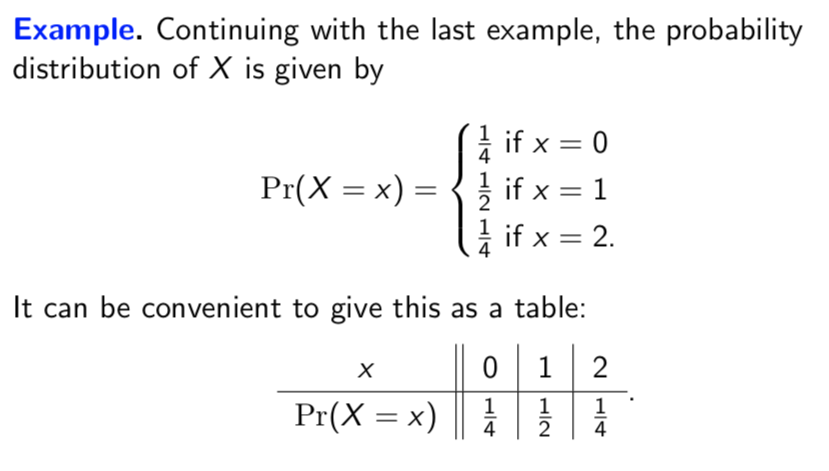

# Lecture 23: Random variables

In a game, three standard dice will be rolled and the number of sixes will be
recorded. We could let _X_ stand for the number of sixes rolled. Then _X_ is a
special kind of variable whose value is based on a random process. These are
called _random variables_.

Because the value of _X_ is random, it doesn't make sense to ask whether , for example. But we can ask what the _probability is_ that  or that . This is because "" and "" correspond to events from our
sample space.

## Formal definition

Formally, a random variable is defined as a function from the sample space to
.

**Example.** Let  be the number of 1s in a binary string of length 2 chosen
uniformly at random. Formally, _X_ is the function from  to
 such that

## Probability distribution

