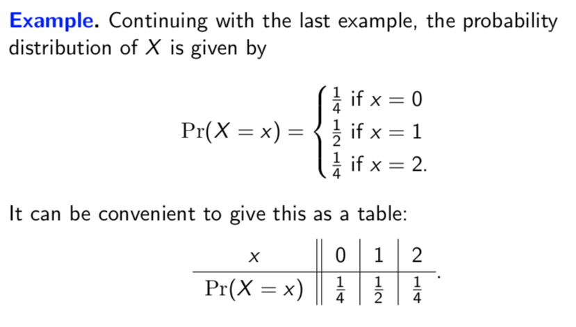

# Lecture 23: Random variables

In a game, three standard dice will be rolled and the number of sixes will be
recorded. We could let _X_ stand for the number of sixes rolled. Then _X_ is a
special kind of variable whose value is based on a random process. These are
called _random variables_.

Because the value of _X_ is random, it doesn't make sense to ask whether $X =
0$, for example. But we can ask what the _probability is_ that $X=0$ or that $X
\geq 2$. This is because "$X=0$" and "$X \geq 2$" correspond to events from our
sample space.

## Formal definition

Formally, a random variable is defined as a function from the sample space to
$\mathbb{R}$.

**Example.** Let $X$ be the number of 1s in a binary string of length 2 chosen
uniformly at random. Formally, _X_ is the function from $\{11,10,01,00\}$ to
$\{0,1,2\}$ such that

$$X(11) = 2, X(10) = 1, X(01) = 1, X(00) = 0$$

## Probability distribution

